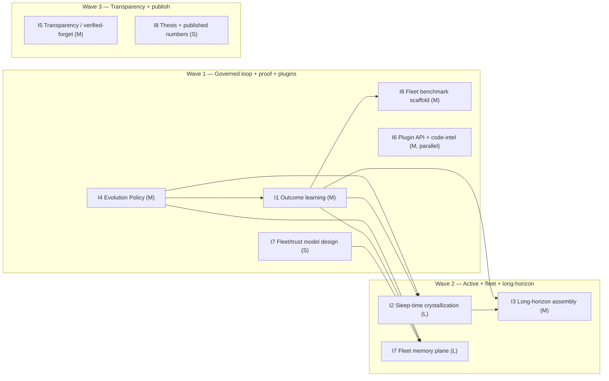

# Zaxy 3 — Governed Active Memory for Agent Fleets

> Status: **canonical Zaxy 3 plan — direction-setting decisions locked 2026-06-27.**
> Grounded in (a) a current-state inventory of the Zaxy codebase, (b) competitor
> teardowns of caura-memclaw and Letta/MemGPT, and (c) the neuroscience-of-memory
> and LLM-agent-memory literature. Citations are real and link-checked. The five
> open decisions from the first draft are now resolved (see §11); wave ordering
> reflects them. Calendar dates still pending team-size confirmation.

---

## 1. TL;DR

The direction is right: **"Governed Active Memory for Agent Fleets,"** measured
aggression. Two things change versus the draft plan:

1. **Sharpen the wedge.** "Governed, shared, self-improving fleet memory" is —
   almost verbatim — caura-memclaw's existing tagline. We cannot win by
   restating the category. Zaxy's defensible, un-copyable moat is the **immutable,
   hash-chained, replayable Eventloom substrate**: every learning step is a
   *gated, replayable, cited event*; forgetting is reversible attenuation, not
   deletion; consolidation is *additive and source-backed*, not destructive
   summarization. Brand on **provable** active memory, not just governed.

2. **Most of Zaxy 3 is "activate + harden," not greenfield.** A code inventory
   found that **9 of 11** capability areas already exist as non-authoritative,
   replayable projections (salience/decay, review-gated consolidation, skill
   memory + outcome analytics, Coordinate promotion, retrieval feedback, cited
   token-budgeted checkout, temporal versioning, hybrid graph retrieval incl. a
   graph-walk/PPR lane). The genuine gaps are exactly two: **no background/idle
   reflection runner** (none, by design) and **no autonomous metacognition loop**
   (primitives exist; nothing fires them on its own). Zaxy 3 should turn the
   existing on-demand machinery *into a governed, default-on loop* — that is
   faster, more credible, and uniquely ours.

The single biggest strategic gap versus the competition is **fleet-scale
cross-agent propagation** (memclaw's whole thesis). The draft plan under-weights
it. We elevate it.

**Decisions locked (2026-06-27; autonomy posture relaxed):** (1) autonomy
defaults to **auto-with-rollback** (reversible auto-apply above threshold); the
strict tiers (propose-only, require-review) are built and available as opt-in;
(2) tagline line: **"Active memory you can
prove."**; (3) **I7 Fleet Memory Plane pulled earlier** (Wave 2, design in Wave
1); (4) **I6 external plugin API now**, not deferred (Wave 1 parallel track);
(5) **I8 fleet/coordination benchmark is a Wave-1 deliverable.** Phasing in §8
reflects all five.

---

## 2. Verdict on the proposed plan

| Proposed initiative | Verdict | Change |
|---|---|---|
| 1. Outcome-Driven Learning Loop | **Keep — #1** | Primitives exist (salience reinforcement, retrieval feedback). Net-new: failure→preventive-rule candidates, prediction-error gating, per-deployment-tunable salience, **and cross-agent outcome propagation**. |
| 2. Background Reasoning / Crystallization | **Keep — #2** | The *scheduler* is the only net-new piece; it must call the existing consolidation/compaction/procedure-mining/salience-replay/metacognition primitives and emit **review-gated, additive** candidates (anti-drift). |
| 3. Advanced Context Assembly | **Keep — #3** | Already strong (token budget, MMR, retention, working set, PPR lane). Net-new: an explicit **recent (episodic) vs remote (consolidated) two-tier** assembly for very long horizons. |
| 4. Governed Memory Evolution | **Keep — Zaxy's moat** | Unify the scattered gates (consolidation review, Coordinate promotion, inferred-edge audit) into one **explicit, configurable autonomy policy**. This is the differentiator; make it loud. |
| 5. Transparency & Controlled Editability | **Keep — scope down** | Projections already exist (export view, dashboard, viewer). Net-new: human-readable edit→re-ingest round-trip (as events) + **verified forgetting / rollback**. |
| 6. Domain Plugins | **Keep — now (Wave 1, parallel)** | Code-intelligence already ships (6 languages); extractor registry + backend contract exist. Net-new: a real *external* plugin contract; decoupled from the loop so it starts now. |
| — | **ADD: Fleet Memory Plane (elevated → Wave 2)** | Cross-agent / cross-session outcome + skill propagation under trust tiers. This is the competition's core and our largest gap; designed Wave 1, built Wave 2. |
| — | **ADD: Proof & Category Definition** | A fleet/coordination benchmark + a published "governed active memory" thesis. The category is won on evidence; do not get baited into single-agent-only benchmarks. |

Net: keep all six, re-rank, add two, and reframe the whole thing as "wire the
loop on, behind the governance line we already enforce."

---

## 3. Competitive landscape

### caura-memclaw (caura-ai) — the direct category rival
- **Positioning:** "Fleet memory for AI agents — governed, shared, self-improving." Multi-tenant, multi-agent, MCP-native. Apache-2.0, Python. (~158★ at survey time, very active; latest release v2.17.0.)
- **Architecture:** mutable PostgreSQL + pgvector + Redis + async event bus. **Not event-sourced.** Hybrid retrieval (vector + keyword + live ≤2-hop KG), LLM per-write enrichment, entity auto-merge.
- **Active learning (shipped):** the **"Karpathy Loop"** — agents report success/fail/partial (`memclaw_evolve`/`/evolve/report`); winners reinforced; **failures auto-generate preventive `rule` memories**. Nightly **Crystallizer** LLM-merges near-dups and retires stale data (autonomous, *not* review-gated). Per-agent retrieval auto-tuning; contradiction auto-supersession.
- **Governance:** tenant isolation, visibility scopes, 4 trust tiers, **keystone policies** (mandatory rules overriding user instructions), PII flagging, and a **tamper-evident hash-chained audit log added v2.17.0** — note: hash-chaining is on the *audit log only*; the memory store itself is mutable.
- **Proof:** [vendor-claimed] eToro (NASDAQ: ETOR) 300+ agents, 26.5k memories, 1,372 shared skills, 23 ms p50. [self-reported] LoCoMo 77.6%, LongMemEval 72.5%, 96–98% token savings.
- **Reads:** they deliberately *reframe away from single-agent benchmarks* (LoCoMo/LongMemEval) toward fleet axes: latency, token efficiency, governance, cross-agent compounding.

### Letta (letta-ai, formerly MemGPT) — the category's brand and research engine
- **Positioning:** "AI with advanced memory that can learn and self-improve over time." ~23.5k★, Apache-2.0, ~$10M seed (Felicis, 2024).
- **Architecture:** MemGPT OS metaphor (arXiv [2310.08560](https://arxiv.org/abs/2310.08560)) — core (in-context **memory blocks**), recall (message history), archival (vector/graph). **Self-editing memory** (insert/replace/rethink tools). Source of truth = SQL blocks/messages.
- **Active learning (shipped + published):** **sleep-time agents** — a background agent shares the primary's memory blocks and asynchronously rewrites them into "learned context" (paper: *Sleep-time Compute*, Lin et al. 2025, arXiv [2504.13171](https://arxiv.org/abs/2504.13171); ~5× less test-time compute). Continual learning "in token space."
- **Governance:** **largely autonomous** edits. Opt-in HITL tool-approval, read-only blocks, and (Letta Code) git-backed "Context Repositories." Concurrency is **last-write-wins**; no tamper-evident log, no first-class citations/grounded checkout.
- **Edge over Zaxy:** mindshare, published research, a strong coding agent (Letta Code) → owns the code-intelligence niche.

### Where this leaves Zaxy
Both rivals are **ahead on the active/self-improving axis** (loop + background reflection shipped in production) and **behind on provenance/governance-by-construction** (mutable stores, autonomous overwrite, last-write-wins). Zaxy is the inverse. Zaxy 3 = close the active gap **without giving up the substrate that makes us un-copyable.**

---

## 4. The differentiation thesis (the moat)

> **Other systems make memory *active* by letting it mutate itself. Zaxy makes
> memory active while keeping every change a gated, replayable, cited event.**

Three claims only Zaxy can make, and the literature now says these are the *right*
claims:

1. **Provable evolution.** Every reinforcement, consolidation, rule, deprecation,
   and forget is an Eventloom event with a citation and a hash-chain position;
   the entire memory state is a replay function of the log. The 2026 security
   literature argues this is mandatory, not optional: long-term-memory security
   "*cannot be retrofitted at retrieval or execution time alone, but must be
   anchored in storage-time provenance, versioning, and policy-aware retention
   from the outset*" — **Verifiable Memory Governance**, Lin et al. 2026 (arXiv
   [2604.16548](https://arxiv.org/abs/2604.16548)). Zaxy already *is* that.
2. **Drift-resistant consolidation.** Competitors crystallize by LLM
   summarize-and-overwrite. SSGM (Lam et al. 2026, arXiv
   [2603.11768](https://arxiv.org/abs/2603.11768)) names the failure mode:
   **semantic drift — "knowledge degrades through iterative summarization."**
   Zaxy's compaction is *additive, medoid/exemplar, source-backed, audited*
   (`compaction.py:audit_event_log` → identity-recall + citation-coverage), and
   never rewrites the log — drift-resistant by construction.
3. **Reversible forgetting.** Forgetting is salience attenuation with a floor
   (clamped ≥ 0.01), so "forgotten" memories leave default ranking but remain one
   explicit query away, with a replayable record of why they faded. Deletion,
   when required, is governed verified-forgetting (crypto-erasure + audit), not a
   silent row update.

**Tagline (locked):** **"Active memory you can prove."** — leads with the
"active memory" category and encodes the moat (provable/replayable). The
"receipts" lineage is retained as supporting copy (e.g. "active memory, with
receipts") and stays the live 2.x site voice until Zaxy 3 ships.

---

## 5. Research foundation (mapped, cited)

### 5a. Neuroscience → mechanism we borrow
- **Complementary Learning Systems** — McClelland, McNaughton, O'Reilly 1995 ([PMC 7624455](https://pubmed.ncbi.nlm.nih.gov/7624455/)); updated for AI in Kumaran, Hassabis, McClelland 2016 ([TICS, PMC 27315762](https://pubmed.ncbi.nlm.nih.gov/27315762/)). Fast pattern-separated episodic store + slow structured store trained by replay. → **Two-tier assembly (#3)**: Eventloom = hippocampal episodic log; consolidated projection = neocortical structure.
- **Systems consolidation** — Frankland & Bontempi 2005 ([nrn1607](https://www.nature.com/articles/nrn1607)). Recent memories are MTL-dependent, then reorganize to cortex. → **recent vs remote tiers (#3)**, time-dependent governed promotion (Coordinate).
- **Hippocampal replay / sleep consolidation** — Wilson & McNaughton 1994 ([Science 8036517](https://www.science.org/doi/10.1126/science.8036517)); Diekelmann & Born 2010 *active systems consolidation* ([nrn2762](https://www.nature.com/articles/nrn2762)). Offline reactivation reorganizes memory. → **background crystallization runner (#2)**.
- **Schema-based fast assimilation** — Tse et al. 2007 ([Science](https://www.science.org/doi/10.1126/science.1135935)). Schema-consistent facts consolidate fast. → assimilate schema-consistent facts quickly, gate novel/conflicting ones (#2/#4).
- **Synaptic tagging & capture / salience** — Frey & Morris 1997 ([Nature 385:533](https://www.nature.com/articles/385533a0)); dopamine-novelty gating, Lisman & Grace 2005; emotional/arousal tagging, McGaugh 2004. Salient/surprising events are preferentially stabilized. → **outcome/prediction-error-weighted reinforcement (#1)**.
- **Reconsolidation** — Nader, Schafe, LeDoux 2000 ([Nature](https://www.nature.com/articles/35021052)); Nader & Hardt 2009; updating is **prediction-error-gated** (Lee). On retrieval a memory becomes labile and can be *updated*. → the neuroscience basis for **governed update-on-recall (#4)** and outcome-gated learning (#1).
- **Adaptive forgetting** — Richards & Frankland 2017 *"The Persistence and Transience of Memory"* ([Neuron](https://www.cell.com/neuron/fulltext/S0896-6273\(17\)30365-3)); Hardt, Nader, Nadel 2013 (decay vs interference). Forgetting is regulated and adaptive, not failure. → **decay-aware retrieval + reversible attenuation (#1/#4)**.

### 5b. Agent-memory systems → what to match/beat
- **MemGPT** (2310.08560) → tiered/paged long-horizon context (**#3**).
- **Generative Agents** (Park et al. 2023, [2304.03442](https://arxiv.org/abs/2304.03442)) → memory stream (recency+importance+relevance) + periodic **reflection** into higher-level memories that **cite their source observations** (**#2**, and a precedent for *cited* consolidation = **#5**).
- **Reflexion** (Shinn et al. 2023, [2303.11366](https://arxiv.org/abs/2303.11366)) → outcome feedback → verbal self-reflection in an episodic buffer (**#1**).
- **Voyager** (Wang et al. 2023, [2305.16291](https://arxiv.org/abs/2305.16291)) → ever-growing library of verified executable skills (**#6**, secondary **#1**).
- **A-MEM** (Xu et al. 2025, [2502.12110](https://arxiv.org/abs/2502.12110)) → Zettelkasten "**memory evolution**" updates linked notes (**#4**).
- **Mem0** (Chhikara et al. 2025, [2504.19413](https://arxiv.org/abs/2504.19413)) → extract-then-update with **ADD/UPDATE/DELETE/NOOP** ops, ~90% token savings (**#3**, governance vocabulary for **#4**).
- **HippoRAG** (Gutiérrez et al. 2024, [2405.14831](https://arxiv.org/abs/2405.14831)) → Personalized PageRank over a schemaless KG for one-shot multi-hop (**#3**; Zaxy already has a `graph_walk` lane).
- **MemoryBank** (Zhong et al. 2023, [2305.10250](https://arxiv.org/abs/2305.10250)) → Ebbinghaus-curve decay/reinforce (**#1/#4**).
- **Larimar** (Das et al. 2024, [2403.11901](https://arxiv.org/abs/2403.11901)) → one-shot edit + selective fact-forgetting (**#5**).
- **Self-RAG** (Asai et al. 2023, [2310.11511](https://arxiv.org/abs/2310.11511)) → reflection tokens + per-segment citations (**#5**, retrieval feedback **#1**).
- **Surveys / vocabulary:** memory-mechanism taxonomy (Zhang et al. 2024, [2404.13501](https://arxiv.org/abs/2404.13501)); six atomic ops — **Consolidation, Updating, Indexing, Forgetting, Retrieval, Condensation** (Du et al. 2025, [2505.00675](https://arxiv.org/abs/2505.00675)) — adopt as our governance vocabulary; continual-learning survey (Shi et al. 2024, [2404.16789](https://arxiv.org/abs/2404.16789)).
- **Governance (validates Zaxy's bet):** SSGM (2603.11768), Verifiable Memory Governance (2604.16548), and provenance/evidence-tracing (Wang et al. 2026, [2606.04990](https://arxiv.org/abs/2606.04990)).

---

## 6. Current-state reality check (what already exists)

From a source inventory — frame each initiative as *activate/harden*, not build:

| Area | Status | Anchors |
|---|---|---|
| Retrieval feedback / reinforcement | **Exists** | `salience.py` (`build_{surfaced,confirmed,promoted,invalidated}_reinforcement_event`, `SalienceLedger`) |
| Salience / decay / forgetting | **Exists** | `salience.py` (half-life 30d, clamp ≥0.01), `query.py` `RetentionPolicy`, `_apply_salience_score` |
| Consolidation (review-gated) + compaction | **Exists** | `consolidation.py` (candidate/review events, always non-authoritative), `compaction.py` (medoid/exemplar + `audit_event_log`), `procedure_mining.py` |
| Skill / procedural memory + analytics | **Exists** | `extract/rules.py` (skill lifecycle), `core/checkout_build.py:_checkout_skill_analytics` (promotion/rollback/contradiction candidates) |
| Governance / promotion gating | **Exists** | `coordination.py` (`promote_finding`, approval packets, perf ledger), `inference.py` (evidence-first), `graph.py:inspect_inferred_edge_status` |
| Memory Checkout / assembly | **Exists** | `checkout.py`, `core/checkout_build.py`, `token_budget.py` (`pack_sections`, elision), `working_set.py`, `query.py` (MMR, SCORING_PROFILES) |
| Temporal / bi-temporal | **Exists** | `graph.py`/`embedded_graph_store.py` (`valid_from/valid_to`, `SUPERSEDED_BY`, `PREVIOUS_VERSION`) |
| Human-readable projection | **Exists** | `export_view.py` (cited entries), `dashboard.py`, `viewer.py` |
| Extensibility | **Exists** | `extract/core.py:register`, `projection.py:ProjectionStore`, `codebase.py` (6-language code intelligence) |
| Metacognition loop | **Partial** | `metacognition.py`, `reasoning_primitives.py` — contracts exist; **agent-invoked, no autonomous monitor** |
| **Background / idle reflection** | **None (by design)** | no daemon; `export_sinks.py`: "does not run a delivery daemon… left to an external scheduler" |

**Load-bearing invariant to preserve:** every derived artifact is
`authority_status=non_authoritative` and a pure replay of the immutable log;
nothing auto-promotes to authority; nothing deletes events.

---

## 7. The Zaxy 3 initiative set (refined)

Each initiative: **goal · research basis · current state · net-new · governance ·
competitive target.**

### I1 — Outcome-Driven Learning Loop *(highest)*
- **Goal:** agents report outcomes on recalled memory; the system reinforces, generates *governed* preventive rules on failure, and tunes retrieval — measurably "better over time."
- **Research:** Reflexion (outcome→reflection), reconsolidation + prediction-error gating (Nader 2000; Lee), synaptic tagging/dopamine novelty (Frey & Morris 1997; Lisman & Grace 2005), MemoryBank.
- **Current:** reinforcement events + salience ledger + retrieval feedback already exist.
- **Net-new:** (a) **failure → preventive-rule candidate** (review-gated; matches memclaw's auto-rule but governed); (b) **prediction-error weighting** (surprise/outcome-mismatch scales reinforcement, replacing the fixed multiplier table); (c) **per-deployment-tunable** salience/half-life (today module constants); (d) outcome-conditioned retrieval tuning.
- **Governance:** rules are non-authoritative candidates until they clear the I4 policy. Auto-tuning is bounded + replayable.
- **Target:** neutralize memclaw's Karpathy Loop; beat it on auditability + reversibility.

### I2 — Governed Sleep-Time Crystallization *(the only big net-new system)*
- **Goal:** an optional background runner that, in idle windows, reflects over the log and emits **additive, review-gated** consolidation/skill/metacognition candidates — turning today's on-demand pipelines into a default loop.
- **Research:** replay + active systems consolidation (Wilson 1994; Diekelmann & Born 2010), Sleep-time Compute (2504.13171), Generative Agents reflection.
- **Current:** the primitives it calls all exist (`compaction.py`, `consolidation.py`, `procedure_mining.py`, salience replay, `metacognition.py`). The **scheduler is genuinely net-new** (Zaxy has no daemon by design).
- **Net-new:** a config-gated scheduler (cron-triggerable, no always-on daemon required) + the "autonomous metacognitive monitor" that fires the existing primitives + amortized "learned context" precompute for checkout.
- **Governance:** background output is **non-authoritative + additive + source-backed** (drift-resistant per SSGM), never a destructive summarize-overwrite. Autonomy level set by I4.
- **Target:** match Letta sleep-time / memclaw crystallizer; differentiate on *no semantic drift, fully replayable*.

### I3 — Long-Horizon Context Assembly
- **Goal:** excellent Memory Checkout over very long histories ("never-ending thread").
- **Research:** CLS two-tier, systems consolidation (recent vs remote), HippoRAG (PPR), Mem0 (token discipline), MemGPT (paging).
- **Current:** strong already (token budget + elision, MMR, retention `current_only`, working set, `graph_walk` lane).
- **Net-new:** explicit **episodic (recent) vs consolidated (remote) two-tier** assembly; horizon-aware compaction *inside* checkout; relevance scoring over very long spans; lean on I2's precomputed learned context.
- **Governance:** consolidated tier stays cited back to source events.
- **Target:** differentiate from retrieval-only tools; "production-grade long thread."

### I4 — Governed Memory Evolution *(the moat — make it explicit)*
- **Goal:** one **configurable, visible autonomy policy** governing when memory may evolve autonomously vs requires review vs is proposal-only.
- **Research:** SSGM (decouple evolution from execution, verify before consolidation), VMG (write-authorization, provenance, rollbackability, verified-forgetting), reconsolidation, A-MEM (evolution), Du et al. atomic ops.
- **Current:** the gates exist but are scattered (consolidation review, Coordinate promotion, inferred-edge audit, confidence thresholds 0.85/0.86).
- **Net-new:** unify into a single **Memory Evolution Policy** with named autonomy tiers — *propose-only* / *auto-with-rollback-window* / *require-review* — per evolution op (consolidate/update/forget/rule-gen), with confidence thresholds and a visible audit of every gate decision.
- **Governance:** this *is* the governance layer; everything in I1/I2 routes through it.
- **Target:** the axis Letta is weakest on and memclaw does autonomously — own "governed."

### I5 — Transparency & Controlled Editability
- **Goal:** human-readable memory views + safe edit/forget paths that still respect the log.
- **Research:** Larimar (edit/forget), VMG (verified forgetting + rollbackability), Self-RAG / Generative Agents (citations).
- **Current:** projections exist (`export_view.py`, `dashboard.py`, `viewer.py`); edits are append-corrective; soft-delete sets `valid_to`.
- **Net-new:** human markdown view → **edit → re-ingest as corrective events** (round-trip); **verified forgetting** (crypto-erasure of payload + tombstone event preserving chain + audit); explicit **rollback** of an evolution.
- **Governance:** edits/forgets are themselves gated events under I4.
- **Target:** answer EverOS-style "editable memory" without breaking provenance.

### I6 — Domain Plugins *(now — Wave 1 parallel track; decoupled from the loop)*
- **Goal:** external plugin contract for specialized intelligence layers, starting with the existing code intelligence.
- **Research:** Voyager (skill library), continual-learning survey (domain adaptation).
- **Current:** in-process extractor registry + projection backend contract + 6-language `codebase.py` already shipped.
- **Net-new:** a stable *external* plugin API (load extractors/skills/projections out-of-process) + package the code-intelligence layer as the reference plugin.
- **Target:** prevent being outflanked in verticals (esp. coding agents vs Letta Code).

### I7 — Fleet Memory Plane *(ADDED — largest competitive gap)*
- **Goal:** governed cross-agent / cross-session propagation of outcomes and skills across a fleet, with trust tiers.
- **Research:** memclaw's fleet thesis; Coordinate is the seed; CLS/systems-consolidation (promote local→shared).
- **Current:** `coordination.py` has worker→parent promotion within a mission; **no fleet-wide outcome/skill propagation plane**.
- **Net-new:** fleet-scoped shared memory with trust tiers/visibility scopes; cross-agent outcome propagation (a failure learned by one agent prevents it fleet-wide) and a **shared skill library** promoted through I4 gates.
- **Governance:** propagation crosses trust boundaries only via I4 gates; every shared memory is cited + replayable.
- **Target:** memclaw's core differentiator (eToro: 1,372 shared skills) — match it, governed.

### I8 — Proof & Category Definition *(cross-cutting; benchmark is a Wave-1 deliverable)*
- **Goal:** win the category on evidence.
- **Net-new:** (a) a **fleet/coordination benchmark** on the axes that compound with agent count (latency, token efficiency, cross-agent transfer, governance correctness) — extend the existing CoordinationBench; do **not** let single-agent LoCoMo/LongMemEval define us (memclaw already reframed away from them); (b) a published "governed active memory" thesis citing SSGM/VMG; (c) keep the honesty discipline (hash/embedding-provider caveats).

---

## 8. Phasing

Effort key (rough, engineering-weeks-class, not calendar): **S** ≈ small,
**M** ≈ medium, **L** ≈ large. Durations are indicative ranges assuming one
small focused team (~2–3 eng) working the primary track with the parallel tracks
staffed opportunistically — **confirm team size to convert to dates.**

- **Wave 1 — governed loop + proof + plugins** *(indicative ~6–9 wk)*.
  Primary track: **I4 evolution policy first** (the gate every active feature
  routes through — building I1/I2 without it just rebuilds the competitors'
  ungoverned model), then **I1 outcome learning** on top, defaulting to
  **auto-with-rollback** (reversible). Parallel decoupled track: **I6** external plugin API +
  code-intelligence as the reference plugin (no dependency on the loop, so it
  starts now). Deliverables also include the **I8 fleet/coordination benchmark
  scaffold** (so every later claim is defensible from day one) and the **I7
  fleet/trust-tier model design** (de-risks Wave 2). *Exit:* outcomes drive
  reinforcement + governed (auto-with-rollback, reversible) rule candidates; autonomy tiers
  configurable + audited; plugin API loads an external code-intel plugin;
  benchmark harness runs.
- **Wave 2 — active + fleet + long-horizon** *(indicative ~8–12 wk)*. **I2**
  governed sleep-time crystallization (reuses I1/I4; additive + replayable, no
  drift); **I7** fleet memory plane (cross-agent outcome + shared-skill
  propagation through I4 gates — the elevated competitive priority); **I3**
  two-tier (episodic/consolidated) long-horizon assembly. *Exit:* idle-time
  governed crystallization; fleet-wide governed propagation; measurably better
  long-thread checkout; benchmark shows cross-agent transfer.
- **Wave 3 — transparency + publish** *(indicative ~4–6 wk)*. **I5**
  human-readable edit→re-ingest round-trip + verified forgetting/rollback; **I8**
  publish the "governed active memory" thesis (SSGM/VMG-grounded) with
  same-harness fleet numbers. *Exit:* full inspect/edit/forget story; public
  category claim with evidence.

**I8 proof runs throughout** and gates each wave's public claims (scaffold in W1,
cross-agent metrics in W2, publication in W3). Calendar dates intentionally
omitted pending team-size confirmation (§11).

---

## 9. Invariants we will not break (the constitution)

These are why Zaxy wins; every Zaxy 3 feature must hold them:

1. **The log is the source of truth.** All derived state is a replay function of the immutable, hash-chained Eventloom. No feature mutates history.
2. **Non-authoritative by default.** Generated artifacts (rules, consolidations, skills, beliefs) carry `authority_status=non_authoritative` until they pass an explicit I4 gate.
3. **No destructive summarization.** Consolidation is additive + source-backed + audited (identity-recall, citation-coverage). We accept SSGM's warning about iterative-summarization drift as a hard constraint.
4. **Forgetting is reversible by default; deletion is governed + verified.** Attenuation never zeroes; hard-delete is crypto-erasure + tombstone + audit.
5. **Everything cites.** Every recalled, consolidated, or propagated item carries an `eventloom://…#hash` citation.
6. **Autonomy is opt-in, reversible, and visible.** "Active" never means "silently irreversible." **Zaxy 3 defaults to auto-with-rollback** (auto-apply above threshold, reversible within the rollback window); the strict tiers (propose-only, require-review) are built and available; the active tier is configured, logged, and replayable.

---

## 10. How we win (success criteria)

- **Differentiation that survives a demo:** show an evolution (rule generated from a failure), then **replay** the exact events that produced it, **roll it back**, and **verified-forget** a payload — none of which memclaw (mutable store) or Letta (last-write-wins) can do.
- **Close the active gap:** outcome loop + governed crystallization shipped and **on by default** (behind the autonomy line), not on-demand CLI.
- **Close the fleet gap:** cross-agent outcome + skill propagation with trust tiers; a fleet benchmark we publish.
- **Category proof:** a published "governed active memory" position grounded in SSGM/VMG, plus same-harness numbers on fleet axes.

---

## 11. Decisions (locked 2026-06-27)

1. **Autonomy line → auto-with-rollback by default (posture relaxed 2026-06-27).**
   Reversible auto-apply above threshold; the strict tiers (propose-only,
   require-review) are built and available as opt-in. Rationale: the market is
   moving fast and does not yet strongly demand extreme guardrails — we ship them
   so they are ready when it does, but they are not the default. Encoded in §9
   invariant 6 and I4.
2. **Tagline → "Active memory you can prove."** "Receipts" retained as
   supporting copy; stays the live 2.x site voice until Zaxy 3 ships (§4).
3. **I7 Fleet Memory Plane → pulled earlier.** Trust/propagation model designed
   in Wave 1, built in Wave 2 (was Wave 3) (§8).
4. **I6 plugins → external plugin API now.** Wave 1 parallel decoupled track,
   not deferred; code-intelligence ships as the reference plugin (§8, I6).
5. **I8 fleet/coordination benchmark → Wave-1 deliverable.** Scaffold lands in
   Wave 1 so every later claim is defensible (§8, I8).

**Still open (not blocking design):** team size/start date → to convert the
indicative wave durations in §8 into a calendar. Confirm staffing and I'll add
dates and a per-initiative work breakdown.

---

### Appendix — competitor fact-check provenance
- caura-memclaw: repo + README + CHANGELOG (read directly), memclaw.net blog (vendor/self-reported figures flagged inline).
- Letta: repo, docs.letta.com, MemGPT (2310.08560) + Sleep-time Compute (2504.13171), funding via TechCrunch/PRNewswire.
- All neuroscience and agent-memory citations link-checked against publisher/arXiv/PubMed pages; the three 2026 governance papers (2603.11768, 2604.16548, 2606.04990) confirmed via the arXiv API. Vendor and third-party metrics are labeled; do not repeat them as Zaxy's own claims.
