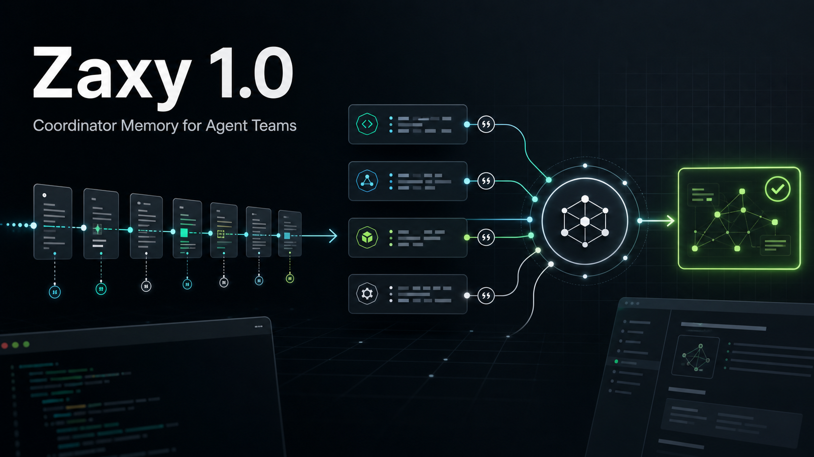

# Zaxy 1.0.0: Coordinator Memory for Agent Teams



Zaxy 1.0.0 is the first stable release of Coordinator Memory for Agent Teams:
an event-sourced, temporal memory fabric for agents that need to coordinate
work, cite what they know, and replay how decisions happened.

The release centers on a narrow promise. Zaxy does not replace every agent
framework and does not hide context behind a vector-only store. It gives agents
Memory Bootstrap instructions, Memory Checkout state, Eventloom provenance,
graph-backed retrieval, and Zaxy Coordinate workflows that make multi-agent
work auditable.

## What Is Stable

- Eventloom remains the append-only source of truth.
- Memory Bootstrap tells models how to use checkout, feedback, and capture.
- Memory Checkout provides current, cited prompt state with diagnostics.
- MCP remains the primary framework-neutral interface.
- Native LangGraph, CrewAI, OpenAI-compatible, and Claude-compatible helpers use
  the shared memory contract where direct integration is useful.
- Zaxy Coordinate records mission, worker, assignment, finding, review,
  promotion, approval packet, checkout, and handoff state.
- Public surfaces are classified in `docs/api-inventory.md` and frozen through
  `docs/examples/v1-schema-freeze.json`.

## Examples

Start with the clean local path:

```bash
zaxy init --preset local-claude
zaxy memory bootstrap
zaxy memory checkout "current project state"
zaxy doctor --beta-readiness
```

For a multi-agent workflow, run:

```bash
python examples/coordinate_three_worker_project.py
```

For a short product-level walkthrough, see
[`../media/zaxy-collaborate-demo.md`](../media/zaxy-collaborate-demo.md).

For direct model-call memory outside MCP, see
`examples/openai_compatible_memory.py` and
`examples/claude_compatible_memory.py`.

## Benchmark Evidence

The v1.0 story is based on reproducible, tracked benchmark artifacts rather
than ad hoc local runs:

- LongMemEval-compatible reports show Zaxy checkout quality, Answer@5,
  Recall@5, citation coverage, and latency alongside BM25 baselines.
- CoordinationBench reports exercise Zaxy Coordinate mission reconstruction,
  accepted precision, conflict detection, and handoff quality.
- The backend shootout reports compare embedded graph behavior, BM25 baselines,
  optional sidecars, query diagnostics, fingerprint checks, and dashboard
  graph-load behavior.
- Release gates check backend shootout evidence with tracked Eventloom inputs,
  query files, `query_results`, citation coverage, p95/p99 latency budgets, and
  fingerprint validation.

## Limitations

- External validation is optional post-release evidence. The current repo has
  first-run timing evidence and UAT scripts; outside-user validation can be
  attached after release when a user, project, or case study is available.
- Candidate backends such as pgGraph and LatticeDB remain experimental until
  they pass the same contract, benchmark, and operations gates as the default
  embedded path.
- Hosted embedding and reranker providers are optional and must be configured
  through secret-managed settings.
- Benchmark claims only apply to the published workload, inputs, retrieval
  limit, scoring code, and citation requirements.

## Roadmap beyond 1.0

After v1.0, the next work should focus on external validation, independent
benchmark review, richer framework-native adapters, sidecar-free runtime
hardening, dashboard polish, and more public examples from real projects.

## External validation

We are asking publicly for external verification after the 1.0.0 release. If
you have not worked on this implementation session, please run one documented
path and report both successes and friction:

```bash
zaxy init
zaxy memory bootstrap --eventloom-path .eventloom
zaxy memory checkout "current project memory and next useful action" --eventloom-path .eventloom
zaxy doctor --beta-readiness
```

or:

```bash
python examples/coordinate_three_worker_project.py
```

Open a GitHub issue with the "External validation" template, or follow
[`../external-validation.md`](../external-validation.md) to create a
machine-checkable report. Useful reports include exact commands, operating
system, shell, Python version, install source, time to first useful checkout or
Coordinate handoff, confusing docs, unexpected sidecar requirements, and a
release decision of pass, pass with follow-up, or fail until fixed.

External verification is optional post-release evidence for 1.0.0, not a hidden
release blocker. Failed validations are welcome because they make the next
release better.

Related references: [../v1-roadmap.md](../v1-roadmap.md),
[../v09-gate-audit.md](../v09-gate-audit.md),
[../benchmarks.md](../benchmarks.md), [../getting-started.md](../getting-started.md),
and [../../README.md](../../README.md).
