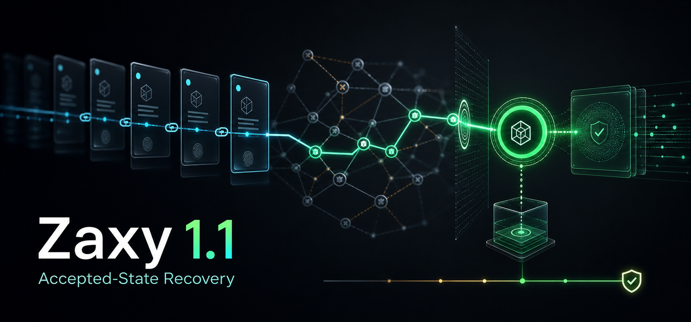

# X Article Draft: Zaxy 1.1.0



Zaxy 1.1.0 is out: accepted-state recovery for agent memory.

The short version: Zaxy now treats "what is the current accepted state?" as a
release-gated memory problem, not a vibes-based retrieval problem.

That matters because multi-agent work creates a very specific failure mode.
Agents explore in parallel. Workers produce local claims. Some are correct,
some are stale, some are partial, and some are plausible distractors. A memory
system that simply recalls all of them has not solved coordination. It has
made confusion searchable.

Zaxy 1.1.0 is about the harder target:

Given a noisy project history, recover the accepted state, cite the evidence,
reject stale claims, resist distractors, and abstain when the evidence is not
strong enough.

What ships:

- StateRecoveryBench, a checkout-backed benchmark for accepted-state recovery;
- a first-class `zaxy state-recovery-benchmark` CLI;
- release guardrails for state accuracy, minimal evidence recall, stale
  rejection, distractor resistance, abstention accuracy, and citation coverage;
- Coordination accepted-state resolution shared by MemoryFabric checkout and
  proof packets;
- archived v1 workload and benchmark reports under
  `reports/benchmarks/state-recovery-v1/`;
- docs explaining what StateRecoveryBench does and does not claim.

The release baseline:

LongMemEval-compatible 500-question run:

| Metric | Score |
|--------|-------|
| Mean | 0.956 |
| Answer@5 | 0.910 |
| Recall@1 | 0.960 |
| Recall@5 | 1.000 |
| Recall@10 | 1.000 |
| Citation coverage | 1.000 |

StateRecoveryBench, MemoryFabric checkout lane:

| Metric | Score |
|--------|-------|
| State accuracy | 0.818 |
| Minimal evidence recall | 0.909 |
| Stale rejection | 1.000 |
| Distractor resistance | 0.818 |
| Abstention accuracy | 1.000 |
| Citation coverage | 1.000 |

Those numbers are not the interesting part by themselves.

The interesting part is what is being measured.

LongMemEval is valuable, but it mostly asks whether a system can retrieve and
answer from long-term memory. That is necessary. It is not sufficient for
coordinated agent work.

CoordinationBench was the first step beyond that. It tests whether a memory
system can support isolated worker sessions, cited findings, review, conflict
handling, and accepted merge-back into parent project state.

StateRecoveryBench narrows the question even further:

Can the memory system recover the state that was actually accepted, after the
history contains stale claims, distracting alternatives, and incomplete bridge
evidence?

This is the class of issue that shows up in real agent teams:

- one worker discovers an answer;
- another worker finds a conflicting clue;
- a reviewer accepts one state and rejects another;
- later agents need the accepted state, not the loudest nearby memory;
- if the evidence is insufficient, the system should say so.

That is why the benchmark includes distractors and no-safe-answer cases. A
memory layer that always returns something can look impressive while being
operationally dangerous. Zaxy 1.1.0 explicitly gates the cases where the right
answer is "do not promote this yet."

The design thesis is simple:

Memory for agents should be event-sourced, temporal, cited, and reviewable.

Accepted state should not be a loose summary. It should be a recoverable
projection over an immutable history, with enough provenance for another agent
or human to audit why the system believes it.

That is the reason Zaxy uses Eventloom logs as the source of truth, graph
projection for structured reasoning, Memory Checkout for current context, and
Coordinate workflows for multi-agent promotion.

Install:

```bash
pip install -U zaxy-memory
zaxy init
```

Run the new benchmark:

```bash
zaxy state-recovery-benchmark \
  --workload reports/benchmarks/state-recovery-v1/state-recovery-workload.json \
  --output-dir /tmp/zaxy-state-recovery
```

The thing I am most excited about is not that Zaxy can hit strong memory
benchmark numbers. It is that the benchmark target is moving closer to the
actual job.

Agents do not only need more recall.

They need memory that knows the difference between:

- observed;
- inferred;
- proposed;
- rejected;
- superseded;
- accepted;
- current.

Zaxy 1.1.0 is a step toward making that distinction enforceable.

Links:

- Release: `https://github.com/syndicalt/zaxy/releases/tag/v1.1.0`
- Benchmarks: `docs/benchmarks.md`
- State recovery report: `reports/benchmarks/state-recovery-v1/state-recovery-benchmark.json`
- Getting started: `docs/getting-started.md`
- Coordinate quickstart: `docs/coordinate-quickstart.md`
