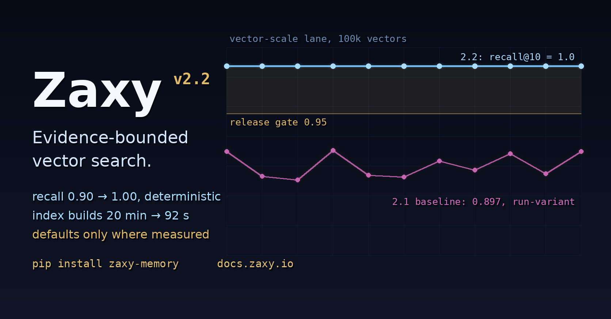

# X Article Draft: Zaxy 2.2.0

Zaxy 2.2.0 is out: evidence-bounded vector search.

The short version: in 2.1, our own benchmark caught our ANN path being worse
than brute force — slower, less accurate, with 20-minute index builds — so we
shipped it disabled. In 2.2 we fixed it, and the defaults moved exactly as far
as the evidence extends and not one dimension further.

That ordering matters. The standard failure mode for approximate
nearest-neighbor search is shipping it because it is supposed to be fast,
then discovering in production that recall quietly cratered or the index
takes the better part of an hour to build. Zaxy's release rule is the
opposite: a default changes only when an evaluation lane that ships in the
repo proves the change at the scale it claims.

What the lane said at the 2.1 baseline, at 100k vectors:

| Metric | ANN (HNSW) | Exact |
|--------|------------|-------|
| Recall@10 | 0.8969, varying per rebuild | 1.000 |
| Query p50 | 37.9 ms | 17.0 ms |
| Full index build | ~20 minutes | seconds |

What it says after 2.2, same scale, double-pass plus a confirmatory run:

| Metric | ANN (HNSW) | Exact |
|--------|------------|-------|
| Recall@10 | 1.000, identical across rebuilds | 1.000 |
| Query p50 | parity to better, in-run | — |
| Full index build | 92 seconds (12.9x) | seconds |

What ships:

- an exact float64 rerank over approximate candidates, which both fixed
  recall and made it deterministic across HNSW's nondeterministic builds;
- bulk index builds through a COPY-based generation swap instead of row
  inserts — 1,180 seconds down to 92 at 100k;
- unfiltered direct-table queries via per-session shadow generations (the
  real overhead was a 16 ms per-query filter scan, not what we suspected);
- engagement defaults bounded to the measured envelope: ANN turns on at
  100k+ vectors up to 64 dimensions. Above that, exact search remains the
  recommendation — measured, not assumed;
- a research paper with the full evidence chain, cited theory, explicit
  math, and the negative results in the same tables as the wins.

The plot twist is the part worth reading the paper for.

At high dimension, recall looked catastrophic — 0.52 — and stayed broken
through every fix. The diagnosis: it was the benchmark, not the index. Our
synthetic test corpus at 1536 dimensions produces a median of 210 vectors
*exactly tied* with the true top-10. When hundreds of candidates are equally
correct, recall@10 against one arbitrary tie-break ordering is not a
measurement; it is a coin flip the index cannot win. Even exact float32
search scores 0.53 against it.

So we fixed the metric in the open: tie-aware recall (standard
ann-benchmarks practice) is now reported alongside the strict number — never
instead of it — and a realistic-distribution control corpus confirmed the
index is healthy at production dimensions. The same correction resurrected
int8 quantization's high-dim score from 0.61 to 1.0. Benchmarks need the
same skepticism as the systems they judge.

Along the way we hit three undocumented crash-or-corrupt defects in our
embedded graph engine — whose upstream is frozen, final release, archived
repo — and designed around all three. They are documented in the paper with
reproductions. That is what depending on frozen infrastructure honestly
looks like.

The claim boundary, because it always matters: every number above is from
internal lanes on synthetic corpora, labeled as such, with raw artifacts
versioned in the repo. Nothing here is an external benchmark claim.

Paper: https://docs.zaxy.io/docs/research/ann-engineering-2026-06.html
Release: https://github.com/syndicalt/zaxy/releases/tag/v2.2.0
Install: `pip install zaxy-memory`

Zaxy is event-sourced memory for agent work: a hash-chained append-only log
as the source of truth, cited Memory Checkout as the trust contract, and
defaults that move on lane evidence. https://docs.zaxy.io
