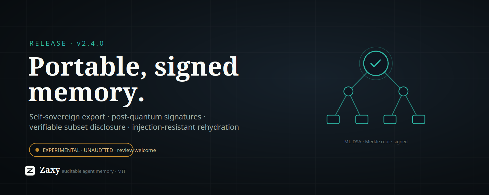

# X Article Draft: Zaxy 2.4.0

Zaxy 2.4.0 ships the first piece of **portable, signed agent memory** — and the
honest headline is that it is **experimental, unaudited, and we are asking for
review before anyone trusts it.**

The short version: agent memory is locked inside vendor runtimes, and the moment
you want to move it — between models, between agents, across a dispute — you need
a way to prove *what* the memory is and *who* vouches for it, while revealing only
the parts you choose. 2.4 adds that, built to the shape the [W3C "AI Agent Memory
Interoperability" Community Group](https://www.w3.org/community/ai-agent-memory-interop/)
(proposed weeks ago) and the *Portable Agent Memory* paper are converging on. It
is opt-in (`pip install zaxy-memory[export]`), it warns loudly on import, and it
makes no security claims it has not earned.

## What shipped

`zaxy.portable` — a self-sovereign, verifiable memory-export layer on top of
Eventloom's existing hash-chained integrity:

- **Signed export bundles.** Post-quantum **ML-DSA-65** (NIST FIPS-204) signatures,
  with Ed25519 as a classical fallback — using vetted `pyca/cryptography`
  primitives, never homegrown ones. Self-sovereign: you hold the key, the public
  key *is* the identity, no certificate authority.
- **Verifiable partial disclosure.** A domain-separated Merkle tree lets you hand
  someone a *subset* of your memory plus an inclusion proof, and they can verify
  it belongs to the signed set **without seeing the rest**.
- **Injection-resistant rehydration.** Recalled content (tool output, transcripts)
  is treated as data, not instructions — guarded fencing + flagging — so resurfaced
  memory can't hijack the next model. Defense-in-depth, not a guarantee.
- **Encryption envelope + cryptographic erasure.** Per-cell AES-256-GCM keys, and
  GDPR-Article-17 erasure by destroying the key (the immutable ciphertext stays,
  permanently undecryptable) — with the hard invariant that key material must never
  enter the append-only log.
- **Capability-scoped sharing** and a pluggable **public anchor** (offline stub
  today; an OpenTimestamps hook for operator-independent verification).

This sits on the 2.3 line that made memory *stick*: per-turn memory injection
(2.3.2, extended to Codex in 2.3.3) that closed the recall-persistence gap, and
opt-in tool-I/O offload provenance (2.3.4).

## Why it matters

Memory you can't move is a lock-in. Memory you *can* move but can't *verify* is a
liability. The interesting problem isn't storage — it's a transfer format that is
**authentic** (signed), **minimally disclosed** (prove a slice, not the whole
history), **forgettable** (cryptographic erasure in an append-only world), and
**safe to rehydrate** into a different model. That's an open frontier — a W3C group
and fresh research are forming around it right now — and Zaxy already had the
right substrate for it: an immutable, hash-chained event log where provenance is
the product, not an afterthought.

## The research behind it

This release is the end of an honest chain of experiments, not a leap of faith:

- We tested whether a **dense symbolic encoding** of memory would help models obey
  it. It didn't: an invented glyph notation *failed comprehension* on both Claude
  and GPT-4.1, and bought ~0% token savings over plain prose. The lesson — reuse a
  notation the model already knows; don't invent one — shaped everything after.
- We found the real lever was **injection, not format**: putting declarative state
  in front of the model lifted adherence from ~0.25 to ~1.0, even buried in a long
  context. That became the 2.3.2 recall fix.
- Hardening tool-I/O provenance (2.3.4) surfaced that our own capture *truncated*
  tool output — a gap in the audit trail. Closing it is what pointed at a proper
  signed-export design.
- For 2.4 we built to the emerging standard's choices — PQ signatures, Merkle
  provenance, crypto-erasure — rather than a bespoke format, so it can interoperate
  instead of fork.

## The honest part — and the ask

We are a small project. We **cannot commission a formal cryptographic audit**, and
we will not pretend a clean self-review is one. What we *have* done is the
proportionate thing: vetted primitives only, an adversarial self-review of the
protocol composition (which already caught and fixed three real issues), opt-in
packaging, a loud import warning, and a written threat model. The self-review is a
*layer*, not a substitute for independent human eyes.

So this is a genuine **call for review**. If you do cryptography or agent-memory
work, please poke holes:

- The composition questions are on
  [crypto.stackexchange](https://crypto.stackexchange.com/) — does binding the
  Merkle root + all metadata under one signature prevent swap attacks; are the
  (non-position-bound) subset proofs forgeable; what breaks crypto-erasure beyond
  "ensure no other key copy survives."
- Design, threat model, and conformance mapping:
  [`docs/experimental/portable-export-security.md`](https://github.com/syndicalt/zaxy/blob/v2.4.0/docs/experimental/portable-export-security.md)
  and the [`zaxy.portable` source](https://github.com/syndicalt/zaxy/tree/v2.4.0/src/zaxy/portable)
  (pinned to v2.4.0).
- If you're in the W3C interop CG: tell us where we diverge from where the spec is
  heading.

Try it: `pip install "zaxy-memory[export]"`, then `zaxy export-keygen`, `zaxy
export`, `zaxy verify-export`. The import warning is intentional — keep it in mind.

Until real review comes back, it stays experimental and unadvertised as anything
more. That's the deal, and we'd rather say it out loud than ship a quiet "trust
me." Findings welcome — break it.
