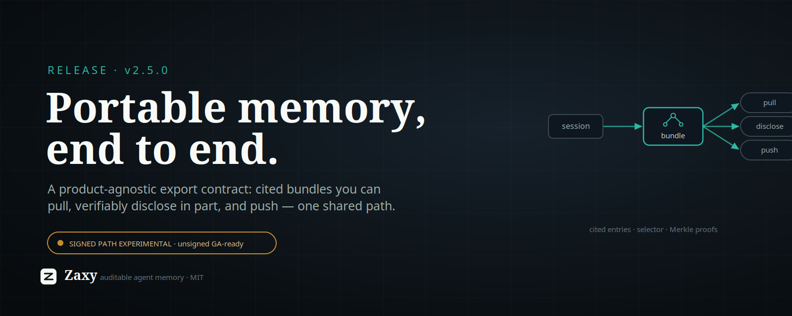

# X Article Draft: Zaxy 2.5.0



Zaxy 2.5.0 ships a **general memory export contract**: a product-agnostic way to
pull a session's memory out as a cited, portable bundle that *any* consumer can
verify — and, if you choose, reveal only a slice of, or push to wherever you
want. Zaxy never has to know who is asking.

The short version: agent memory is only as useful as it is *movable* and
*trustworthy*. Most memory is trapped inside a vendor runtime, and even when you
can get it out, you usually can't prove what it is or hand over just the relevant
part. 2.5 makes export a first-class, specified contract — built so the thing on
the other end can be a dashboard, an auditor, another agent, or a "second brain"
product, without Zaxy taking a dependency on any of them.

## What shipped

A contract in four layers, all converging on one projection path so the bytes are
identical no matter which surface you use:

- **A canonical entry schema (`zaxy.export.v1`).** Every exported item is a
  self-describing JSON entry carrying a **sealed Eventloom citation**
  (`eventloom://<thread>/events/<seq>#<hash>`). Two grains: raw `event` entries,
  and `semantic` entries (entities and edges) from the deterministic extractor.
  Provenance is in the format, not bolted on.
- **A selection contract.** An `ExportSelector` picks what to export — by grain,
  event type, sequence or time window, a verbatim-query pre-filter, sensitivity
  redaction, and a `since` **delta cursor** so a consumer can sync only what
  changed.
- **Pull surfaces.** A `memory_export` MCP tool and a generalized `zaxy export`
  CLI. A consumer pulls; Zaxy stays the authoritative upstream source.
- **Verifiable partial disclosure.** Hand someone a *subset* of a signed bundle
  with Merkle inclusion proofs — they verify those entries belong to the signed
  set **without seeing the rest** (`export-disclose` / `verify-export-subset`).
- **Outbound delivery.** Optional file and webhook sinks plus `zaxy export-push`,
  for the cases where you want Zaxy to *send* a bundle rather than wait to be
  asked. One-shot by design; cron handles "recurring."

It builds directly on the 2.4 line — the `zaxy.portable` signed-bundle format
(post-quantum ML-DSA-65 signatures, a domain-separated Merkle tree) — and wraps
it in the contract that was missing around it.

## Why it matters

The interesting problem with agent memory isn't storage; it's a **transfer
format** that is authentic (cited, optionally signed), **minimally disclosed**
(prove a slice, not the whole history), and **decoupled** (the producer doesn't
need to know the consumer). That's the shape a W3C community group and recent
"portable agent memory" research are converging on, and Zaxy already had the right
substrate: an immutable, hash-chained event log where provenance *is* the product.

This is deliberately **not** a step toward Zaxy becoming a "second brain." Zaxy
stays auditable agent memory; the export contract is exactly the seam that lets a
brain-style product — or anything else — consume Zaxy as a verifiable source,
without Zaxy ingesting unverifiable bulk data and diluting what makes it
trustworthy.

## The honest caveats

- **Signing is EXPERIMENTAL and UNAUDITED.** The signed-bundle and partial-
  disclosure paths depend on `zaxy.portable`, which is opt-in
  (`pip install zaxy-memory[export]`), warns loudly on import, and is pending an
  independent cryptographic review before any general-availability use. Treat
  signed export as a preview. The **unsigned** canonical export carries no such
  caveat and is usable today.
- **Keys never travel in band.** Over MCP, signing uses a *server-configured*
  key only — a private key is never accepted as a tool argument. The CLI and
  webhook auth read keys/tokens from files, never inline.
- **Export is a read of your memory.** The `memory_export` tool is admin-gated and
  session-scoped; redaction and disclosure are there so you ship only what you
  intend to.

## Try it

The contract is specified in [`docs/export-contract.md`](../export-contract.md) —
entry schema, selector, the three bundle shapes, both surfaces, and the
versioning policy a consumer can pin against.

```sh
# Pull an unsigned, cited bundle for a session.
zaxy export --out bundle.json --eventloom-path .eventloom --session-id agent-1

# Reveal only the goal entries, with proofs, from a signed bundle.
zaxy export-disclose bundle.json --grains event --kinds goal.created --out subset.json
zaxy verify-export-subset subset.json --expect-public-key <hex>
```

Memory you can't move is lock-in. Memory you can move but can't verify is a
liability. 2.5 is the format in between — and we'd genuinely welcome review of the
signed path before anyone leans on it.
