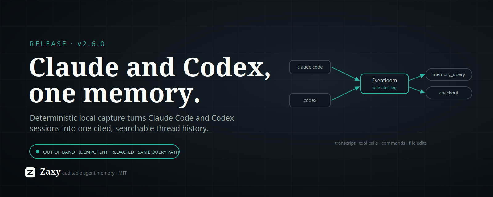

# X Article Draft: Zaxy 2.6.0



Zaxy 2.6.0 makes agent thread history **cross-tool**: a `zaxy claude-capture`
command that turns your local Claude Code sessions into the same cited,
searchable Eventloom memory that `zaxy codex-capture` already produces. One
project, two coding agents, **one memory** — searchable through the exact same
query path, with **no new retrieval surface** to learn.

The short version: your work with an agent is the most valuable context you have,
and it is normally trapped in that vendor's local session log, in that vendor's
shape, readable by nothing else. 2.5 made memory *portable out*. 2.6 makes the
two agents you actually code with *capturable in*, into one place, on equal terms.

## What shipped

`zaxy claude-capture` reads Claude Code's own local session JSONL under
`~/.claude/projects` (or `$CLAUDE_CONFIG_DIR`) and imports each conversation into
Eventloom as **first-class normalized observations** — the same event types Codex
capture emits:

- **transcript turns** — user and assistant text (reasoning/thinking blocks are
  never ingested);
- **tool calls** — Read, Edit, Grep, Task, and the rest;
- **commands** — Bash invocations with their exit signal;
- **file edits** — Edit / Write / NotebookEdit targets.

Because those are the *same* event types, captured Claude turns flow through the
*same* extraction → projection → hybrid retrieval path and surface through the
existing `memory_query` MCP tool and `memory checkout`. There is deliberately **no
new search surface**: unified Claude Code and Codex thread search falls out of
reusing the path that already exists.

It is built to be safe to run unattended:

- **Out-of-band.** It reads the log Claude already writes; it never proxies model
  traffic.
- **Workspace-scoped.** Each session is matched to your project by the record's
  own `cwd`, so only this repo's conversations are imported.
- **Idempotent.** Turns are de-duplicated by source ref, so re-running — or a
  `--watch` loop — only ever adds what is new.
- **Redacted.** Transcript and command content pass through the same secret
  masking as Codex capture.

Run it one-shot, or `--watch` for continuous capture (`--watch-iterations <n>`
for bounded supervisor/CI passes), and add `--graph` to project new observations
into the graph immediately.

## Why it matters

Memory that only knows about one tool is a silo with extra steps. The point of an
event-sourced, cited memory layer is that *provenance is the product* — and
provenance is far more useful when it spans the tools you actually switched
between to get the work done. Ask "what did I change in the auth module and why"
and get an answer drawn from both the Claude session where you reasoned about it
and the Codex session where you ran the tests, each turn carrying an
`eventloom://…#<hash>` citation back to the exact source.

This is also the boring, correct kind of feature: it ships by *reusing* the
capture, projection, and query machinery that was already load-bearing for Codex,
rather than bolting on a parallel "Claude path." Less surface, same guarantees.

## The honest caveats

- **Standalone today.** `zaxy claude-capture` is the one-shot and `--watch`
  command. It is not yet wired into the managed capture supervisor or `zaxy init`
  onboarding the way Codex capture is — there is no `.claude/zaxy-capture.json`
  and no `zaxy activate claude` in this release. The command covers both modes;
  the managed integration is next.
- **Top-level sessions.** Capture scans the main session files; subagent turns
  are already inlined in those files, so the deeper `subagents/` logs are
  intentionally skipped to avoid double-ingest.
- **Reasoning is never captured.** Thinking blocks are dropped by design —
  parity with Codex, and a privacy/leanness choice, not an oversight.

## Try it

```sh
# One-shot: import this repo's Claude Code sessions into Eventloom.
zaxy claude-capture --workspace . --eventloom-path .eventloom --session-id default

# Continuous capture, bounded for a supervisor or CI.
zaxy claude-capture --watch --watch-iterations 2

# Then search Claude + Codex turns through the existing surface.
zaxy memory checkout "what did I change in the auth module and why"
```

Two agents, one cited log, one query. Memory you can search across the tools you
actually work in — and still prove where every line came from.
