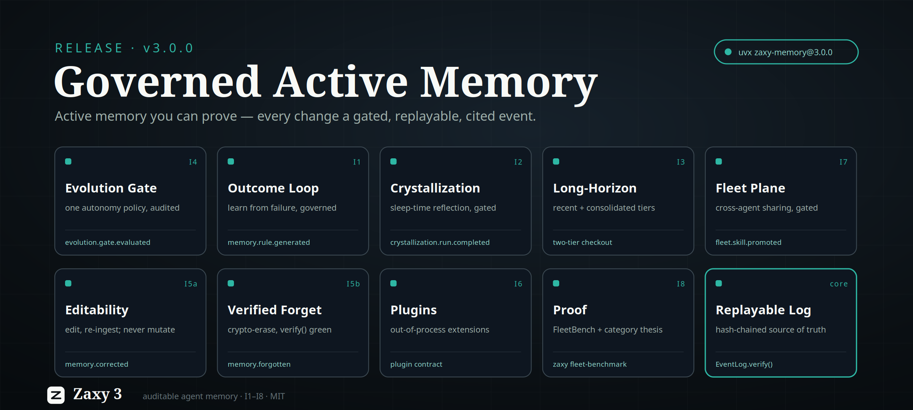

# X Article Draft: Zaxy 3.0.0



Zaxy 3.0.0 is here, and it has a thesis: **Governed Active Memory.**

The whole agent-memory field has converged on one idea — memory should be
*active*. It should reflect on experience, distill skills, prevent repeated
mistakes, and get better over time. The two strongest rivals make memory active
by letting it **mutate itself**: one runs an autonomous nightly "crystallizer"
over a mutable store; another lets the model self-edit memory blocks under
last-write-wins. Both ship working active-learning loops. Both, by construction,
give up the ability to answer *"what changed, why, on whose evidence — and can we
take it back?"*

Zaxy 3 takes the inverse bet:

> Other systems make memory active by letting it mutate itself. Zaxy makes memory
> active while keeping every change a **gated, replayable, cited event.**

The substrate is an append-only, hash-chained Eventloom log; the entire memory
state is a pure **replay** of that log. Every learning step — a reinforcement, a
generated rule, a consolidation, a cross-agent promotion, a forget — is one more
sealed event with a citation and a chain position. **Active memory you can
prove.**

## What shipped

Zaxy 3 is eight initiatives behind one governance line. The order matters: the
gate came first, and everything that learns routes through it.

**The governance gate (I4).** One configurable autonomy policy decides when
memory may evolve **autonomously**, when it **requires review**, and when it is
**proposal-only** — set globally and per-operation (e.g.
`evolution_op_autonomy="forget=propose_only"`). Every decision is a replayable
`evolution.gate.evaluated` event. The shipped default is **auto-with-rollback**:
above threshold a change auto-applies but stays reversible inside the rollback
window; the strict tiers ship as opt-in. Outcome rules, crystallization, and
fleet promotion all pass through this one gate — there is no ungated path to
evolution.

**Outcome-driven learning (I1).** Agents report success/failure/partial outcomes
on recalled memory. A failure can generate a **governed preventive rule**
(`memory.rule.generated`, or held as `memory.rule.proposed`) through the gate, and
reinforcement is **prediction-error weighted** — surprise scales the update, the
way reconsolidation does in the brain. Same trigger as the competitors' auto-rule,
but the rule is non-authoritative, cited, and reversible. New `memory_outcome` MCP
tool and `zaxy memory outcome` CLI.

**Governed sleep-time crystallization (I2).** An optional, config-gated reflection
pass (off by default, no always-on daemon) schedules the consolidation,
procedure-mining, metacognition, compaction-audit, and salience-replay primitives
that already existed, routes every fresh candidate through the gate, and appends a
single cited `crystallization.run.completed` summary. Output is **additive and
source-backed** — never a destructive summarize-and-overwrite. The literature now
has a name for the failure mode we refuse: *semantic drift* from iterative
summarization (SSGM, 2026). The MCP surface stays pull-only.

**Long-horizon assembly (I3).** For never-ending threads, Memory Checkout can
split an explicit **episodic (recent) vs. consolidated (remote)** tier; older
history is carried by its *cited consolidation candidates*, never by re-summarizing
raw text. Two tiers, both still cited back to source events.

**Transparency & controlled editability (I5).** Human edits **re-ingest** as cited
`memory.corrected` events — the original is never mutated. `memory_rollback`
reverses a prior evolution with a cited `memory.rolled_back` event. And **verified
forgetting**: a payload sealed with `forgettable=True` is encrypted at append time
(`__zaxy_cipher`); `memory_forget` destroys the wrapped key and appends a cited
`memory.forgotten` tombstone, so the plaintext is permanently unrecoverable —
while the ciphertext and its hash are untouched and `EventLog.verify()` stays
green. "Forgotten" without breaking the chain.

**External plugin API (I6).** A stable out-of-process contract for extractors,
skills, and projections, with the six-language code-intelligence layer packaged as
the reference plugin. Specialized intelligence layers, decoupled from the loop.

**The fleet memory plane (I7).** The biggest gap against the competition, now
closed *our* way. An outcome, rule, or skill learned by one agent becomes cited,
replayable fleet knowledge — but it crosses a trust boundary **only** through the
I4 gate. Trust tiers and visibility scopes; a dedicated `fleet.<id>` thread;
`fleet.skill.promoted` / `fleet.outcome.propagated` / `fleet.rule.propagated` plus
review / rollback / supersession events. Promotion raises *visibility*, never
*authority*; conflicts are additive supersessions, not autonomous merges;
un-sharing is a reversible rollback. "Which agent taught the fleet this, from what
evidence?" is a replay query, not a side log. New `fleet_*` MCP tools and a `zaxy
fleet` CLI.

**Proof & category (I8).** `zaxy fleet-benchmark` scores the axes that compound
with agent count, and the published **Governed Active Memory** thesis maps every
claim to shipped code, grounded in the 2026 governance literature.

## The demo no mutable store can run

This is the part that survives a live demo. One Eventloom session, four steps:

1. **Evolve** — an agent reports a failure on a recalled memory; the gate fires
   (`evolution.gate.evaluated`) and a cited `memory.rule.generated` event is
   appended.
2. **Replay** — reconstruct *exactly* how that rule came to be: the precise
   failure observations and the gate decision that produced it, with
   `EventLog.verify()` confirming the chain is intact.
3. **Roll it back** — `memory_rollback` appends a cited `memory.rolled_back`
   event that undoes the rule's effect on replay, without mutating the original.
4. **Verified-forget** — crypto-erase a payload; the plaintext is gone for good,
   yet the hash chain still verifies.

A mutable store cannot replay *how* a rule was formed — it overwrote the evidence.
A last-write-wins store cannot guarantee a rollback or an erasure leaves an intact,
tamper-evident chain. Governed Active Memory does all four because each step is
just one more sealed, cited event.

## Why it matters

The competitors are ahead on the *active* axis — a shipped loop plus background
reflection in production. They are behind on **provenance and governance by
construction**: mutable stores, autonomous overwrite, last-write-wins. Zaxy 3
closes the active gap *without* surrendering the substrate that makes the
provenance claims true. The 2026 security literature increasingly argues this is
the right bet — long-term-memory security "cannot be retrofitted at retrieval or
execution time alone, but must be anchored in storage-time provenance, versioning,
and policy-aware retention from the outset" (Verifiable Memory Governance, 2026).
Zaxy is that from the substrate up.

## The honest caveats

Drawing the evidence boundary is part of the claim. So, plainly:

- **Governance correctness is real and measured.** On the FleetBench scaffold,
  `governance_correctness = 1.0` and `coordination_quality ≈ 0.907` are exact,
  deterministic, fingerprinted aggregates, and token efficiency rises with worker
  count (0.535 → 0.587 → 0.646 at 3 / 5 / 8 workers).
- **The cross-agent transfer number is a within-mission proxy.** It scores
  worker→parent promotion inside one mission; true fleet-wide transfer at scale is
  shipped (I7) but not yet measured here.
- **The LongMemEval 500 headline uses the hash embedding provider.** Recall@5
  0.972 and citation coverage 1.000 prove the retrieval/citation **plumbing and
  recall parity** — they do *not* measure semantic retrieval quality, which is
  unproven at scale here.
- **No same-harness head-to-head with the rivals.** Their figures are vendor- or
  self-reported on their own harnesses; we don't restate them as ours.
- **The erasure crypto is experimental and unaudited.** Verified forgetting reuses
  Zaxy's portable-bundle envelope — do not rely on it for compliance guarantees
  without an independent cryptographic review.

No number above is a substitute for the others. The category claim rests on the
governance/provenance properties, which are proven; performance and head-to-head
claims are explicitly deferred.

## Try it

```sh
# Install
uvx zaxy-memory@3.0.0        # or: pip install -U zaxy-memory

# Report an outcome; a failure can mint a governed, cited preventive rule
zaxy memory outcome --outcome failure --summary "retried a rate-limited call without backoff"

# Roll back an evolution, then verified-forget a payload — chain stays valid
zaxy memory rollback --target-seq <n> --target-hash <hash>
zaxy memory forget   --target-seq <n> --target-hash <hash>

# Share a skill fleet-wide, through the governance gate (proposer must be enrolled)
zaxy fleet promote-skill <fleet_id> --skill-id <id> --skill-version 1 \
  --origin-session <sid> --confidence 0.9 --actor <agent>

# Prove the category on the axes that compound with agent count
zaxy fleet-benchmark --worker-counts 3,5,8 --missions 1
```

Read the thesis: `docs/research/governed-active-memory.md`. Read the plan:
`ZAXY-3.md`.

Active memory that reflects, learns, and forgets — and still proves where every
change came from. **That's Zaxy 3.**
