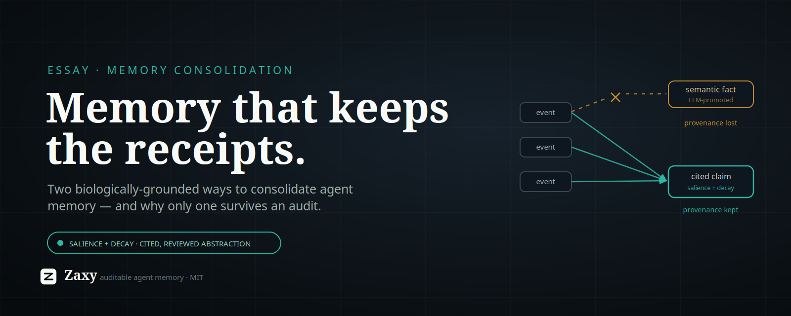

# Memory Consolidation That Keeps the Receipts

*On two biologically-grounded ways to consolidate agent memory — and why only one of them survives an audit.*

Every agent-memory system eventually faces the same question: as the log grows, what do you keep, what do you let fade, and what do you turn into durable, reusable knowledge? This is **consolidation**, and the literature now treats it as one leg of memory's lifecycle — *formation → evolution (consolidation & forgetting) → retrieval* ([Memory in the Age of AI Agents, survey](https://github.com/Shichun-Liu/Agent-Memory-Paper-List)).

Two strategies dominate. Both borrow from neuroscience. Both are real. The interesting part is what happens when you ask each one to *prove what it knows* — because that is a demand we put on software that biology never has to meet.

## Strategy one: episodic → semantic (Complementary Learning Systems)

The most common framing in agent-memory papers is a tiered promotion: specific episodes get distilled into general "semantic" facts, often by an asynchronous daemon that summarizes recent episodes and writes them to a higher tier (e.g. [MemTier](https://arxiv.org/html/2605.03675v1)'s "consolidation daemon promoting episodic facts to a semantic tier").

This rests on serious neuroscience: **Complementary Learning Systems** (McClelland, McNaughton & O'Reilly, 1995) explains why brains have *two* systems — a hippocampus that learns fast, sparse, pattern-separated episodes, and a neocortex that slowly integrates across episodes to extract latent semantic structure, with the transfer happening via replay during sleep ([CLS, PubMed](https://pubmed.ncbi.nlm.nih.gov/22141588/)). Episodic → semantic is not a hand-wave at the level of *biology*. It's textbook.

## Strategy two: reinforcement + decay (Synaptic Homeostasis)

The other strategy keeps a single pool of memories and adjusts a continuous **salience** signal: things get reinforced when they're used or confirmed, and decay toward irrelevance over time. Nothing is promoted to a new tier; importance is a graded property of the same items.

This also rests on serious neuroscience: the **Synaptic Homeostasis Hypothesis** (Tononi & Cirelli) holds that during waking, synapses broadly potentiate; during sleep, the brain *downscales* weaker synapses while reactivating and preserving the ones that matter ([Sleep and the Price of Plasticity, Neuron 2014](https://pmc.ncbi.nlm.nih.gov/articles/PMC3921176/)). Reinforce-on-use plus homeostatic decay is, almost exactly, reinforcement + recency decay.

Crucially, the neuroscience says these two processes are **not rivals** — memories are consolidated by "two apparently antagonistic processes: reinforcement of memory-specific cortical interactions and homeostatic reduction in synaptic efficiency," operating *together*. CLS extracts structure; SHY reweights and prunes. The brain does both.

## So why prefer one for *agent* memory?

Because an agent-memory system is asked to do something a brain is not: **prove what it knew, and why it said what it said.**

A brain has no audit obligation. It can blur a hundred episodes into "I'm good at X" and never be asked for the receipts. Software increasingly *is* asked — for compliance, for debugging, for trust, for the simple question "where did that come from?" That single difference changes which mechanism you should copy.

Watch what happens to **provenance** under each strategy:

- **Episodic → semantic, as implemented in AI**, is where provenance quietly dies. The promotion step is almost always an LLM summarizing episodes into a new "semantic fact." That fact is a *generation*, not a measurement; it's detached (or weakly linked) from the events it came from; and it's written by a daemon with no gate, so a confident-but-wrong abstraction becomes "general knowledge" and then gets reinforced because it keeps surfacing. This is the model-collapse failure mode: a system learning from its own synthetic output. The biology (CLS) is sound; the *cargo-culted software version* — "have the model promote things on a timer" — throws away the one property the software actually needed.

- **Reinforcement + decay** preserves provenance by construction. It never mints a new fact; it reweights *existing, cited* items. The original events stay the source of truth. "What mattered" emerges from behavior — reinforcement on use and feedback — not from a model's guess about what *should* be general. And it maps cleanly onto SHY: reactivation strengthens, disuse downscales, continuously, with no lossy tier boundary to adjudicate.

There's one honest thing episodic → semantic offers that pure reinforcement + decay does not: **generalization**. Reweighting never abstracts; it only ranks. The brain's neocortex genuinely extracts reusable structure, and that's valuable.

## Keep the generalization. Keep the receipts.

You don't have to choose between "abstraction" and "provenance." You only have to refuse the version of abstraction that discards provenance.

The disciplined synthesis:

1. **Continuous reinforcement + decay** for the *what-matters / forgetting* axis — SHY-flavored, provenance-preserving, online. Importance is graded and emerges from use.
2. **Cited, governed abstraction** for the *generalization* axis — instead of a daemon silently promoting episodes, generate abstraction candidates that **carry citations to the exact events they derive from** and **pass a review gate before becoming authoritative**. You get the CLS upside (reusable structure) without the hand-wave (synthesis cut loose from its sources).

This is the move biology can't make and software must: add the audit trail the brain never needed. Copy the *function* of consolidation — keep what matters, forget what doesn't, generalize what recurs — without copying the *mechanism* that loses the receipts.

## Why this matters now

Agent architectures are converging on a clean split: a structured memory **substrate** with a reasoning/synthesis **layer** over it — see [CoALA](https://arxiv.org/abs/2309.02427) (typed memory modules read/written by reasoning) and [HINDSIGHT](https://arxiv.org/pdf/2512.12818) (a "structured substrate" with a separate "reflection layer that reasons over this bank"). In that world, *where* consolidation happens decides whether the whole stack is trustworthy. If consolidation in the substrate quietly fabricates and detaches, every layer above inherits unfalsifiable memory. If the substrate keeps continuous salience and only ever produces *cited, reviewable* abstractions, the layers above inherit something you can actually audit and — increasingly the demand — *own and take with you*.

Consolidation is not a tidiness feature. It is the moment a memory system decides whether it will be able to show its work. Pick the strategy that keeps the receipts.

## References

- McClelland, McNaughton & O'Reilly, *Complementary Learning Systems* — [PubMed](https://pubmed.ncbi.nlm.nih.gov/22141588/), [Wiley](https://onlinelibrary.wiley.com/doi/10.1111/j.1551-6709.2011.01214.x)
- Tononi & Cirelli, *Sleep and the Price of Plasticity* (Synaptic Homeostasis Hypothesis) — [Neuron / PMC](https://pmc.ncbi.nlm.nih.gov/articles/PMC3921176/)
- *Cognitive Architectures for Language Agents (CoALA)* — [arXiv:2309.02427](https://arxiv.org/abs/2309.02427)
- *HINDSIGHT: Building Agent Memory that Retains, Recalls, and Reflects* — [arXiv:2512.12818](https://arxiv.org/pdf/2512.12818)
- *MemTier: Tiered Memory Architecture* — [arXiv:2605.03675](https://arxiv.org/html/2605.03675v1)
- *Memory in the Age of AI Agents: A Survey* — [paper list](https://github.com/Shichun-Liu/Agent-Memory-Paper-List)
