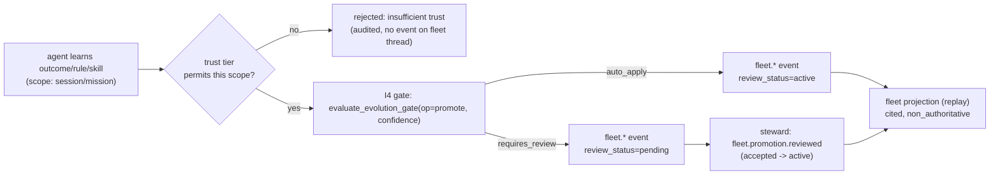

# Zaxy 3 — I7 Fleet Memory Plane: Trust & Propagation Model (Design)

> **For agentic workers:** This is a **design document**, not yet an executable
> task-by-task plan. The orchestrator reviews and finalizes it before I7 is
> built. Sections 1–5 are the contract-level model; Section 6 is the incremental
> build plan an implementing agent can execute. Open design questions are flagged
> in Section 7 — do **not** silently resolve them. Grounded in `ZAXY-3.md` (I7,
> elevated to Wave 2; design is a Wave-1 deliverable) and the shipped I4 gate.

**Goal:** Define how an outcome, preventive rule, or skill learned by one agent
becomes governed, cited, replayable knowledge for an entire fleet — where a
memory crosses a trust boundary **only** through the shipped I4 evolution gate,
promotion raises *visibility* but never *authority*, and "which agent taught the
fleet this, from what evidence" is always answerable by replay.

**Architecture:** Eventloom remains the single source of truth. I7 adds a
**fleet plane**: a dedicated Eventloom thread per fleet (`fleet.<fleet_id>`) into
which cross-boundary promotions are appended as `fleet.*` events. A fleet memory
is never a copy or a mutation of the source; it is a new, non-authoritative event
that **cites** the originating events (`eventloom://<thread>/events/<seq>#<hash>`)
and is gated by I4 (op `promote`). Any enrolled agent's fleet-scoped projection
is a pure replay function of that thread plus member events whose
`visibility_scope` reaches `fleet`. Nothing here mutates history or auto-promotes
to authority. This mirrors the existing `coordination.py` worker→parent
promotion, lifted from a single mission to a governed fleet.

**Tech Stack:** Python 3.11+, Eventloom JSONL, `SessionManager`/`eventlog`
append + replay (sync, as in `coordination.py`), the I4 policy primitives in
`evolution_policy.py` (`resolve_evolution_policy`, `evaluate_evolution_gate`,
`build_evolution_gate_event`), `config.py` Settings, Typer CLI, MCP Python SDK,
pytest. Deterministic, embedded/Eventloom-only; no Neo4j required for the core
contracts.

---

## Inherited invariants (constitution — non-negotiable)

Every artifact this design introduces obeys `ZAXY-3.md §9`:

1. **Log is source of truth.** Fleet state is a replay of `fleet.<id>` + cited member events; no fleet feature mutates history.
2. **Non-authoritative by default.** Every `fleet.*` event carries `authority_status="non_authoritative"`. Promotion raises **visibility scope**, never authority — there is no path in I7 that makes anything authoritative.
3. **No destructive summarization.** Conflicting fleet skills/outcomes are handled by **additive supersession**, never overwrite or delete.
4. **Forgetting is reversible.** Un-sharing is `fleet.promotion.rolled_back` (an additive event that lowers effective scope), never a delete; the superseded/rolled-back event stays replayable.
5. **Everything cites.** Every `fleet.*` event carries `source_events` (the originating `{seq, hash}` snapshots) and `gate_event` (the `evolution.gate.evaluated` it routed through).
6. **Autonomy opt-in, reversible, visible.** The fleet plane is config-gated off by default (`fleet_enabled`); auto-applied promotions are reversible within the I4 rollback window and every decision is an audited event.

---

## 1. Trust tiers & visibility scopes

Zaxy splits two controls that caura-memclaw collapses into one numeric trust
level on a mutable store. Keeping them orthogonal is the structural difference.

### 1a. Visibility scope — *how far a memory is replayed*

A conservative-first ladder, carried as event-payload metadata on every
memory-bearing event that opts into the plane:

```python
VISIBILITY_SCOPES: tuple[str, ...] = ("private", "session", "mission", "fleet", "global")
DEFAULT_VISIBILITY_SCOPE = "session"
```

| scope | replayed into | meaning |
|---|---|---|
| `private` | the authoring agent only | explicitly non-shareable |
| `session` | the originating Eventloom thread (today's default) | worker/agent-local |
| `mission` | a Coordinate mission (parent + workers) | **already exists** via `coordination.finding.promoted` |
| `fleet` | a named fleet thread `fleet.<fleet_id>` | the I7 cross-mission / cross-session plane |
| `global` | the reserved `fleet.global` thread | deployment-wide (single Eventloom root; cross-root federation is out of scope — see Q3) |

`visibility_scope` is **metadata, not authority**: it controls which projection
replays a memory, nothing more. Pre-I7 events without the field are treated as
`session` (backward-compatible; see Q7). A memory is "promoted" by emitting a new
`fleet.*` event at a higher scope that **cites** the lower-scope source — the
source event is untouched.

### 1b. Agent trust tier — *what scope an agent may propose into*

```python
TRUST_TIERS: tuple[str, ...] = ("untrusted", "member", "trusted", "steward")
DEFAULT_TRUST_TIER = "member"   # see Q1
```

| tier | may author up to | may **propose** crossing to | governance powers |
|---|---|---|---|
| `untrusted` | `session` | — (no cross-boundary) | none — sandboxed/buggy agents cannot reach shared knowledge |
| `member` | `mission` | `fleet` (gated, never global) | none |
| `trusted` | `mission` | `fleet`, `global` (gated) | none |
| `steward` | `mission` | `fleet`, `global` (gated) | review held promotions, assign trust tiers, set keystones |

Trust tier is **authorization** (who may *propose* a crossing); it is assigned by
an audited, reversible `fleet.trust.assigned` event (steward authority). It is
**not** the I4 autonomy tier — the I4 gate independently decides whether a *valid*
proposal auto-applies or is held. Three independent controls compose on every
crossing:



---

## 2. Propagation model

**Propagation = appending a cited promotion event into a fleet thread and
replaying it into the fleet projection.** No copy, no mutation, no LLM merge. The
source memory stays in its origin thread; the fleet learns by replay.

### 2a. Flow

1. Agent A in session/mission learns via the existing I1 loop: `memory.outcome.recorded`, `memory.rule.generated` / `memory.rule.proposed`, or the skill lifecycle (`skill.validated`, `skill.outcome_recorded`). These are session/mission scope.
2. A (or a steward, per trust tier) **proposes** a cross-boundary promotion. The crossing is an evolution op routed through the shipped gate — **this is the I4 integration point**:
   ```python
   policy   = resolve_evolution_policy(settings)                       # evolution_policy.py
   decision = evaluate_evolution_gate("promote", confidence, policy=policy)
   gate_evt = build_evolution_gate_event(actor=actor, session_id=fleet_thread,
                                         decision=decision, candidate_ref=source_ref)
   # gate event appended to fleet thread, then cited by the fleet.* event
   ```
   `op="promote"` is already a member of `EVOLUTION_OPS`, so **no change to
   `evolution_policy.py` is required**. Under the default `auto_with_rollback`
   tier, confidence ≥ 0.85 auto-applies (reversible within the rollback window);
   below threshold it is held for review. Operators tighten this with the
   **existing** per-op override `evolution_op_autonomy="promote=require_review"`
   — no new gate config (see Q4).
3. Emit the fleet event citing the source events **and** the gate event:
   - `auto_apply` → `review_status="active"` (immediately in the fleet projection).
   - `requires_review` → `review_status="pending"` (recorded + auditable, but **excluded** from the fleet checkout lane until a steward accepts it).
4. Any enrolled agent B replays the fleet projection at checkout and receives the promoted skill/outcome/rule as a **cited, non-authoritative** context item. B can `skill.applied` / `record_outcome` against it; those new outcomes can themselves propagate back — the compounding loop, governed.

### 2b. Proposed event types

Namespace `fleet.<noun>.<verb>`, consistent with `coordination.<noun>.<verb>`
and `memory.<noun>.<verb>`. Every payload includes
`authority_status="non_authoritative"` and `fleet_id`. Builders are pure
functions in `fleet.py` returning `{"event_type", "actor", "payload", "thread"}`,
exactly mirroring `build_outcome_event` / `build_rule_event` in
`outcome_learning.py` (validate non-empty strings; snapshot `{seq, hash}` refs;
deterministic sha256 ids).

**Registration / governance:**

| event_type | key payload fields |
|---|---|
| `fleet.created` | `fleet_id`, `summary`, `actor`, `authority_status` |
| `fleet.agent.enrolled` | `fleet_id`, `agent_id`, `trust_tier`, `actor`, `authority_status` |
| `fleet.trust.assigned` | `fleet_id`, `agent_id`, `trust_tier`, `prior_tier`, `rationale`, `actor`, `authority_status` |

**Propagation (the plane):**

| event_type | key payload fields |
|---|---|
| `fleet.skill.promoted` | `promotion_id`, `fleet_id`, `skill_id`, `skill_version`, `origin_session`, `origin_actor`, `visibility_scope` (`"fleet"`/`"global"`), `confidence`, `source_events: [{seq,hash}]`, `gate_event: {seq,hash}`, `review_status` (`active`/`pending`), `keystone: bool`, `authority_status` |
| `fleet.outcome.propagated` | `promotion_id`, `fleet_id`, `outcome` (`success`/`failure`/`partial`), `summary`, `claim_key?`, `origin_session`, `origin_actor`, `visibility_scope`, `confidence`, `source_events`, `gate_event`, `review_status`, `authority_status` |
| `fleet.rule.propagated` | `promotion_id`, `fleet_id`, `rule_id`, `rule`, `trigger`, `origin_session`, `origin_actor`, `visibility_scope`, `confidence`, `source_events`, `gate_event`, `review_status`, `keystone: bool`, `authority_status` |

**Lifecycle (governance, conflict, reversal):**

| event_type | key payload fields |
|---|---|
| `fleet.promotion.reviewed` | `fleet_id`, `promotion_id` (cites the pending event), `decision` (`accepted`/`rejected`/`deferred`), `rationale`, `actor` (steward), `source_events`, `authority_status` |
| `fleet.promotion.rolled_back` | `fleet_id`, `promotion_id`, `reason`, `within_rollback_window: bool`, `actor`, `source_events`, `gate_event?`, `authority_status` |
| `fleet.memory.superseded` | `fleet_id`, `claim_key`/`skill_id`, `superseded_promotion_id`, `superseding_promotion_id`, `reason`, `source_events`, `authority_status` |

`review_status` domain: `pending | active | rejected | deferred | superseded |
rolled_back`. `promotion_id` is deterministic:
`fleetpromo:<sha256(canonical{fleet_id, kind, origin_session, source_events})[:24]>`
(same construction as `_rule_id` in `outcome_learning.py`), so the same source
promoted twice is idempotent.

---

## 3. Governance

- **Every cross-boundary propagation is I4-gated.** The `fleet.*` event is always
  preceded by an `evolution.gate.evaluated` (op `promote`) appended to the fleet
  thread and cited via `gate_event`. There is no ungated path to fleet scope.
- **Nothing auto-promotes to authority.** `authority_status` is permanently
  `non_authoritative`. "Promotion" only raises `visibility_scope`. Authority,
  if ever wanted, would require a separate explicit gate path that I7 does **not**
  add. This is the sharp line: *scope ≠ authority.*
- **Trust boundaries enforced by scope + gate, never by deletion.** A memory below
  an agent's reachable scope is simply **not replayed** into that agent's
  projection — it is never deleted. Revoking a shared memory is
  `fleet.promotion.rolled_back` (additive, lowers effective scope); the original
  promotion remains in the log and replayable.
- **Three composable controls** (Section 1b): trust tier caps the *proposable*
  scope; the I4 gate decides *auto vs review*; a steward reviews *held* proposals.
  A breach of any one stops the crossing, and the stop is itself auditable.
- **Keystones (mandatory fleet rules)** are representable as
  `fleet.rule.propagated` with `keystone=true` + `review_status="active"`, surfaced
  in checkout as **mandatory cited guidance**. Unlike memclaw's keystones (rows
  that override prompts on a mutable store), a Zaxy keystone is still
  non-authoritative, cited, and reversible — it is *surfaced*, never silently
  enforced by mutation. (Scope of keystone work in I7 is Q2.)

---

## 4. Conflict & provenance

- **Additive supersession, never destructive.** When a new `fleet.skill.promoted`
  / `fleet.outcome.propagated` conflicts with an active fleet memory on the same
  `skill_id` / `claim_key`, the manager emits `fleet.memory.superseded` citing
  **both** the prior and the superseding `promotion_id`. The prior event is
  **retained** in the projection marked `review_status="superseded"` (still
  cited, still replayable); a later `fleet.promotion.rolled_back` of the winner
  can re-activate it. No `fleet.*` event is ever deleted or overwritten.
- **Conflict detection reuses existing primitives.** Lift
  `LocalSemanticConflictDetector`, `ConflictState`, `_detect_source_state_conflicts`,
  and the `claim_key` matching from `coordination.py` to fleet scope rather than
  inventing a second detector (a second convention beside an existing one is
  prohibited).
- **Provenance is the substrate, not a side log.** Every `fleet.*` event carries
  `origin_session` + `origin_actor` + `source_events` citations back to the exact
  sealed event and hash. "Why does the fleet believe X / which agent taught this
  and from what evidence?" is a deterministic replay query
  (`fleet_audit(fleet_id)`), not an audit-log lookup that can drift from the store
  it describes — because in Zaxy the store *is* the chain.
- **Default conflict posture:** auto-supersession of a non-keystone active memory
  is allowed only when the superseding promotion itself auto-applied (gate
  `auto_apply`); a conflict against an **active keystone** is always held
  `pending` for a steward (never auto-flip a live mandatory rule). See Q5.

---

## 5. Differentiation vs caura-memclaw

caura-memclaw stores fleet memory in a **mutable PostgreSQL + pgvector** store
governed by visibility scopes (`agent`/`team`/`org`), a numeric 4-tier agent
trust level, and keystone policies, with an autonomous nightly "Crystallizer"
that LLM-merges near-duplicates and retires stale data *without* review, and
hash-chaining applied only to a *separate* audit log
([memclaw.net/docs/governance-keystones](https://memclaw.net/docs/tutorials/governance-keystones/),
[memclaw.net/docs/agents](https://memclaw.net/docs/agents/),
[arxiv.org/html/2606.24535](https://arxiv.org/html/2606.24535)). Zaxy's I7 plane
is the **same immutable, hash-chained, replayable Eventloom**: a fleet memory is
a cited event replayed into a fleet projection, it crosses a trust boundary
**only** through the I4 gate, promotion raises visibility but never authority,
conflicts are additive supersessions (never autonomous merges or retirement),
forgetting is a reversible rollback event, and provenance is the chain itself —
so "which agent taught the fleet this, from which sealed event+hash" is a replay,
not a query against a log that can diverge from a mutable store. memclaw makes
shared fleet memory *possible and autonomous*; Zaxy makes it *governed,
reversible, and provable* — the same fleet thesis, but every shared skill is a
receipt, not a row.

---

## 6. Incremental build plan

### File structure

Create:

- `src/zaxy/fleet.py` — fleet contracts: `VISIBILITY_SCOPES` / `TRUST_TIERS` constants + validators; deterministic `promotion_id`; pure `build_fleet_*_event` builders; `FleetManager` (sync, owns the fleet thread via `SessionManager`, routes promotions through the I4 gate); replay projections (`fleet_brief`, `resolve_fleet_skills`, `fleet_audit`). Mirrors `outcome_learning.py` (builders) and `coordination.py` (`CoordinationManager`).
- `tests/test_fleet.py` — builder/validator/replay/conflict unit tests (Eventloom-only).
- `tests/test_fleet_manager.py` — `FleetManager` gated-propagation, trust-tier, review/rollback/supersession tests.

Modify:

- `src/zaxy/coordination.py` — add the mission→fleet bridge (`escalate_finding_to_fleet`) so an accepted `coordination.finding.promoted` can be proposed fleet-wide; no change to existing promotion behavior.
- `src/zaxy/config.py` — add I7 Settings fields (opt-in + default trust tier).
- `src/zaxy/extract.py` — deterministic extractors for `fleet.skill.promoted` / `fleet.rule.propagated` / `fleet.outcome.propagated` so active fleet memories project for checkout retrieval (reuse the skill/rule extractor pattern).
- `src/zaxy/mcp_server.py` + `docs/examples/mcp-tool-contract.json` — `fleet_*` MCP tools + `_fleet_manager()` (twin of `_coordination_manager()`) + dispatch entries + contract snapshot.
- `src/zaxy/cli/runtime.py` + `src/zaxy/cli/serving.py` (+ `__init__.py` re-exports) — a `fleet_app` Typer group (twin of `coordinate_app`).
- `src/zaxy/core/...` (checkout) — a fleet-memory checkout lane (distinct, cited, non-authoritative), reusing the skill-lane pattern.
- `docs/agent-events.md`, `docs/mcp.md` — document the `fleet.*` taxonomy and surfaces.

> **No `evolution_policy.py` change required** — `promote` is already in
> `EVOLUTION_OPS`, and stricter governance uses the existing
> `evolution_op_autonomy="promote=…"` override.

### Proposed signatures

```python
# src/zaxy/fleet.py — constants
VISIBILITY_SCOPES: tuple[str, ...] = ("private", "session", "mission", "fleet", "global")
DEFAULT_VISIBILITY_SCOPE = "session"
TRUST_TIERS: tuple[str, ...] = ("untrusted", "member", "trusted", "steward")
DEFAULT_TRUST_TIER = "member"
PROMOTE_OP = "promote"  # the EVOLUTION_OPS member this plane routes through

FLEET_SKILL_PROMOTED_EVENT_TYPE   = "fleet.skill.promoted"
FLEET_OUTCOME_PROPAGATED_EVENT_TYPE = "fleet.outcome.propagated"
FLEET_RULE_PROPAGATED_EVENT_TYPE  = "fleet.rule.propagated"
# ... (created / enrolled / trust.assigned / promotion.reviewed / rolled_back / memory.superseded)

def fleet_thread(fleet_id: str) -> str: ...          # -> f"fleet.{validate_session_id(fleet_id)}" (':' is illegal in session ids)
def validate_visibility_scope(scope: object) -> str: ...
def validate_trust_tier(tier: object) -> str: ...
def max_proposable_scope(trust_tier: str) -> str: ... # untrusted->session, member->fleet, trusted/steward->global

# pure builders (mirror outcome_learning.build_rule_event)
def build_fleet_skill_promotion_event(*, actor: str, fleet_id: str, skill_id: str, skill_version: str,
    origin_session: str, origin_actor: str, source_events: Sequence[Mapping[str, Any]],
    gate_event: Mapping[str, Any], confidence: float, auto_applied: bool,
    visibility_scope: str = "fleet", keystone: bool = False) -> dict[str, Any]: ...
def build_fleet_outcome_propagation_event(*, ...) -> dict[str, Any]: ...
def build_fleet_rule_propagation_event(*, ...) -> dict[str, Any]: ...
def build_fleet_promotion_review_event(*, actor, fleet_id, promotion_id, decision, rationale=None, source_events) -> dict[str, Any]: ...
def build_fleet_promotion_rollback_event(*, actor, fleet_id, promotion_id, reason, within_rollback_window, source_events) -> dict[str, Any]: ...
def build_fleet_supersession_event(*, actor, fleet_id, claim_key, superseded_promotion_id, superseding_promotion_id, reason, source_events) -> dict[str, Any]: ...
def build_fleet_enrollment_event(*, actor, fleet_id, agent_id, trust_tier) -> dict[str, Any]: ...
def build_fleet_trust_event(*, actor, fleet_id, agent_id, trust_tier, prior_tier, rationale=None) -> dict[str, Any]: ...

# replay projections (pure functions over events)
def summarize_fleet_events(events: Iterable[Mapping[str, Any]]) -> dict[str, Any]: ...
def resolve_fleet_skills(events: Iterable[Mapping[str, Any]]) -> list["FleetSkillState"]: ...  # active, honoring superseded/rolled_back


class FleetManager:
    def __init__(self, eventloom_path: str | Path = ".eventloom", *, settings: Any | None = None,
                 semantic_conflict_detector: SemanticConflictDetector | None = None) -> None: ...

    def create_fleet(self, fleet_id: str, *, summary: str, actor: str = "coordinator") -> FleetEventResult: ...
    def enroll_agent(self, fleet_id: str, agent_id: str, *, trust_tier: str = DEFAULT_TRUST_TIER,
                     actor: str = "coordinator") -> FleetEventResult: ...
    def assign_trust(self, fleet_id: str, agent_id: str, *, trust_tier: str, actor: str,
                     rationale: str | None = None) -> FleetEventResult: ...

    def promote_skill(self, fleet_id: str, *, skill_id: str, skill_version: str, origin_session: str,
                      source_events: list[dict[str, Any]], confidence: float, actor: str,
                      visibility_scope: str = "fleet", keystone: bool = False) -> FleetPromotionResult: ...
    def propagate_outcome(self, fleet_id: str, *, outcome: str, summary: str, origin_session: str,
                          source_events: list[dict[str, Any]], confidence: float, actor: str,
                          claim_key: str | None = None, visibility_scope: str = "fleet") -> FleetPromotionResult: ...
    def propagate_rule(self, fleet_id: str, *, rule: str, trigger: str, origin_session: str,
                       source_events: list[dict[str, Any]], confidence: float, actor: str,
                       visibility_scope: str = "fleet", keystone: bool = False) -> FleetPromotionResult: ...

    def review_promotion(self, fleet_id: str, promotion_id: str, *, decision: str, actor: str,
                         rationale: str | None = None) -> FleetEventResult: ...
    def rollback_promotion(self, fleet_id: str, promotion_id: str, *, reason: str, actor: str) -> FleetEventResult: ...

    def fleet_brief(self, fleet_id: str) -> FleetBrief: ...
    def fleet_audit(self, fleet_id: str) -> FleetAuditReport: ...

    # internal: enforce trust tier, route through the I4 gate, append gate + fleet event, run conflict/supersession
    def _gate_promotion(self, *, candidate_ref: dict[str, Any], confidence: float, actor: str,
                        thread: str) -> EvolutionGateDecision: ...
```

`_gate_promotion` is the single I4 chokepoint (pure functions, sync append, as in
the `inference` gate path):

```python
policy   = resolve_evolution_policy(self._settings)
decision = evaluate_evolution_gate(PROMOTE_OP, confidence, policy=policy)
gate_spec = build_evolution_gate_event(actor=actor, session_id=thread, decision=decision, candidate_ref=candidate_ref)
gate_evt = self.session_manager.get(thread).eventlog.append(
    gate_spec["event_type"], actor=gate_spec["actor"], payload=validate_payload(gate_spec["payload"]), thread=thread)
# fleet.* event then cites {"seq": gate_evt.seq, "hash": gate_evt.hash}
```

```python
# src/zaxy/coordination.py — bridge (new method on CoordinationManager)
def escalate_finding_to_fleet(self, mission_id: str, finding_id: str, fleet_id: str, *,
    fleet_manager: "FleetManager", as_skill: bool = False, actor: str = "coordinator",
) -> "FleetPromotionResult":
    """Propose an already-accepted mission finding as a fleet outcome/skill via the I4 gate.
    Cites the mission `coordination.finding.promoted` event as source_events."""
```

```python
# src/zaxy/config.py — I7 Settings fields (new section "Fleet memory plane (Zaxy 3 / I7)")
fleet_enabled: bool = Field(default=False, description="Enable the governed fleet memory plane (opt-in, off by default)")
fleet_default_trust_tier: str = Field(default="member", description="Default trust tier for newly enrolled fleet agents: untrusted, member, trusted, or steward")
# Stricter fleet governance reuses the EXISTING evolution_op_autonomy override, e.g. "promote=require_review".
```

### Increment split

- **I7.1 — Fleet contracts & vocabulary.** `fleet.py` constants, validators,
  deterministic `promotion_id`, all pure `build_fleet_*_event` builders,
  `summarize_fleet_events` / `resolve_fleet_skills`. Tests: builders set
  `authority_status="non_authoritative"`, cite `source_events`+`gate_event`,
  reject invalid scope/tier/refs, ids are deterministic. *Exit:* `tests/test_fleet.py` green; no manager, no I/O.
- **I7.2 — FleetManager + gated propagation + opt-in.** `FleetManager`
  (`create_fleet`, `enroll_agent`, `assign_trust`, `promote_skill`,
  `propagate_outcome`, `propagate_rule`) routing every crossing through
  `_gate_promotion`; trust-tier eligibility enforced before the gate; `config.py`
  `fleet_enabled` + `fleet_default_trust_tier`. Tests: a crossing appends an
  `evolution.gate.evaluated` cited by the `fleet.*` event; auto-applies above
  threshold and holds `pending` below; `untrusted` proposal is refused;
  `evolution_op_autonomy="promote=require_review"` forces `pending`. *Exit:*
  `tests/test_fleet_manager.py` green.
- **I7.3 — Review, rollback, conflict & supersession + projections.**
  `review_promotion`, `rollback_promotion`, `fleet.memory.superseded` (reusing the
  `coordination.py` conflict detectors), `fleet_brief`, `fleet_audit`. Tests:
  pending→active on accept; rollback re-lowers scope additively and re-activates a
  superseded skill; superseding never deletes; conflict against an active keystone
  holds `pending`. *Exit:* lifecycle tests green.
- **I7.4 — Surfaces & retrieval.** `extract.py` fleet extractors; `fleet_*` MCP
  tools + `_fleet_manager()` + dispatch + contract snapshot; `fleet_app` CLI
  group; fleet checkout lane; `docs/agent-events.md` + `docs/mcp.md`. Tests:
  MCP/CLI twins produce identical cited events; checkout surfaces active
  (not pending/superseded) fleet memories with citations.
- **I7.5 — Coordination bridge + fleet-transfer proof hook.**
  `escalate_finding_to_fleet`; an I8 CoordinationBench hook measuring cross-agent
  transfer (a failure learned by agent A prevents the same failure for agent B
  after propagation). Tests: bridge cites the mission promotion; transfer metric
  is computed from replay only.

---

## 7. Open questions for the orchestrator

1. **Default trust tier & first-steward bootstrap.** Default new enrollee to
   `member` (can propose fleet, gated) or `untrusted` (read-only until promoted)?
   And who is the first steward — is the `fleet.created` actor implicitly a
   steward, or must an out-of-band operator seed the first `fleet.trust.assigned`?
   *Recommendation:* default `member`; fleet creator is implicit steward, recorded
   explicitly in `fleet.created`.
2. **Keystone scope in I7.** Ship keystones now as `keystone=true` fleet rules
   surfaced as mandatory checkout guidance (non-authoritative + cited + reversible),
   or defer full keystone semantics to a later increment / I5? *Recommendation:*
   carry the `keystone` flag + checkout surfacing in I7.3–I7.4; defer any
   override-resolution semantics.
3. **`global` scope semantics.** Treat `global` as the reserved single-root
   `fleet.global` thread now, with cross-Eventloom-root federation explicitly out
   of scope? *Recommendation:* yes — reserve the scope, defer federation.
4. **Per-op threshold config.** Rely solely on the existing
   `evolution_op_autonomy="promote=…"` override for stricter fleet governance (no
   new gate config), or also add a configurable `promote` confidence threshold?
   *Recommendation:* reuse the existing override; add a threshold knob only if a
   real deployment needs it.
5. **Conflict posture.** Allow auto-supersession of a non-keystone active fleet
   memory when the superseding promotion auto-applied, while always holding
   conflicts against an **active keystone** for steward review? *Recommendation:*
   yes (Section 4 default).
6. **Retrieval scoping.** Should an enrolled agent's checkout pull fleet memories
   automatically (enrollment-gated replay) or require explicit per-query opt-in?
   *Recommendation:* enrollment-gated and visible (a checkout diagnostic names the
   fleet lane), respecting invariant 6 (visible autonomy).
7. **Pre-I7 backfill.** Confirm that pre-I7 events lacking `visibility_scope` are
   treated as `session` (no migration, fully backward-compatible). *Recommendation:* yes.
